# RustCI System Design Documentation

This document provides a comprehensive overview of the RustCI system architecture, component interactions, and request flow patterns.

## System Overview

RustCI is a high-performance CI/CD platform built in Rust that provides pipeline execution, deployment management, and service orchestration capabilities. The system is designed for speed, reliability, and ease of use.

## Architecture Diagram

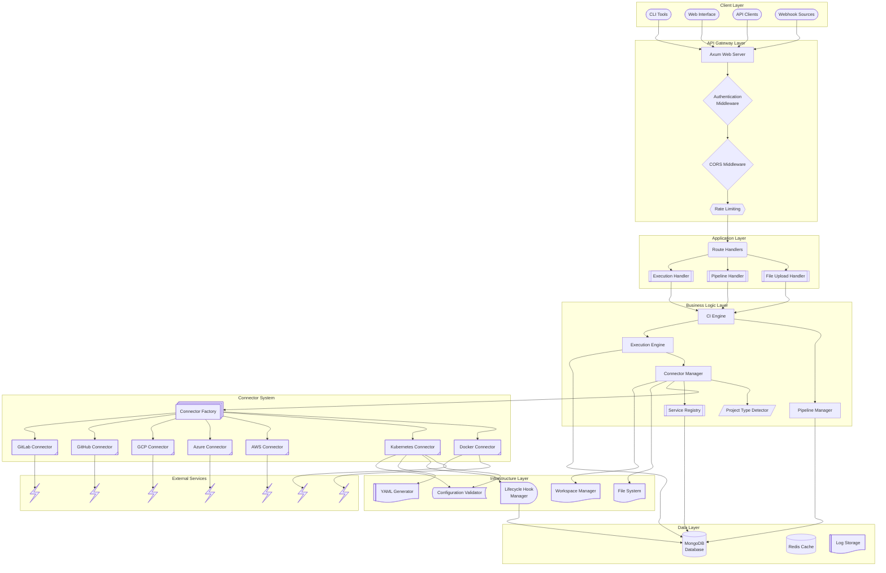

## Component Descriptions

### API Gateway Layer

#### Axum Web Server
- **Purpose**: HTTP server handling all incoming requests
- **Technology**: Axum framework with Tokio async runtime
- **Responsibilities**:
  - Request routing
  - HTTP/1.1 and HTTP/2 support
  - WebSocket connections (future)
  - Static file serving

#### Authentication Middleware
- **Purpose**: JWT-based authentication and authorization
- **Features**:
  - Token validation
  - User session management
  - OAuth integration (GitHub)
  - Role-based access control

#### CORS Middleware
- **Purpose**: Cross-origin resource sharing configuration
- **Configuration**:
  - Allowed origins
  - Allowed methods
  - Credential handling

### Application Layer

#### Route Handlers
- **Pipeline Routes**: `/api/ci/pipelines/*`
- **Execution Routes**: `/api/ci/executions/*`
- **Authentication Routes**: `/api/sessions/*`
- **Health Check**: `/api/healthchecker`

#### File Upload Handler
- **Purpose**: Handle multipart file uploads for YAML configurations
- **Features**:
  - File size validation (10MB limit)
  - MIME type checking
  - Temporary file management
  - YAML content validation

### Business Logic Layer

#### CI Engine
- **Purpose**: Core orchestration engine for CI/CD operations
- **Responsibilities**:
  - Pipeline lifecycle management
  - Execution coordination
  - Resource allocation
  - Error handling and recovery

```rust
pub struct CIEngine {
    pipeline_manager: Arc<PipelineManager>,
    execution_engine: Arc<ExecutionEngine>,
    deployment_manager: Arc<DeploymentManager>,
    database: Arc<Database>,
}
```

#### Pipeline Manager
- **Purpose**: Manage pipeline definitions and configurations
- **Operations**:
  - CRUD operations for pipelines
  - YAML parsing and validation
  - Pipeline versioning
  - Trigger management

#### Execution Engine
- **Purpose**: Execute pipeline stages and steps
- **Features**:
  - Parallel stage execution
  - Step dependency resolution
  - Real-time status updates
  - Log aggregation
  - Timeout handling

#### Connector Manager
- **Purpose**: Unified facade for managing all connector operations
- **Responsibilities**:
  - Factory registration and management
  - Connector caching and lifecycle
  - Step execution routing
  - Configuration validation
- **Design Patterns**:
  - Facade Pattern: Single interface for all connectors
  - Factory Pattern: Dynamic connector creation
  - Strategy Pattern: Pluggable execution strategies

#### Project Type Detector
- **Purpose**: Automatically detect project types for deployment
- **Detection Rules**:
  - File pattern matching
  - Directory structure analysis
  - Content-based detection
  - Confidence scoring

#### Service Registry
- **Purpose**: Track and manage deployed services
- **Features**:
  - Service registration
  - Health monitoring
  - Agent communication preparation
  - Service discovery

## Connector System Architecture

The connector system is the core execution engine that provides pluggable, extensible pipeline step execution across different platforms and services.

### Design Patterns

#### Strategy Pattern
Each connector implements the `Connector` trait, allowing different execution strategies:

```rust
#[async_trait]
pub trait Connector: Send + Sync {
    async fn execute_step(&self, step: &Step, workspace: &Workspace, env: &HashMap<String, String>) -> Result<ExecutionResult>;
    fn connector_type(&self) -> ConnectorType;
    fn name(&self) -> &str;
    fn validate_config(&self, step: &Step) -> Result<()>;
    async fn pre_execute(&self, step: &Step) -> Result<()>;
    async fn post_execute(&self, step: &Step, result: &ExecutionResult) -> Result<()>;
}
```

#### Factory Pattern
The `ConnectorFactory` creates connector instances dynamically:

```rust
#[async_trait]
pub trait ConnectorFactory: Send + Sync {
    fn create_connector(&self, connector_type: ConnectorType) -> Result<Arc<dyn Connector>>;
    fn supports_type(&self, connector_type: &ConnectorType) -> bool;
    fn name(&self) -> &str;
}
```

#### Facade Pattern
The `ConnectorManager` provides a unified interface for all connector operations:

```rust
pub struct ConnectorManager {
    factories: HashMap<String, Arc<dyn ConnectorFactory>>,
    connector_cache: HashMap<ConnectorType, Arc<dyn Connector>>,
}
```

### Connector Types

#### Docker Connector
- **Purpose**: Execute steps in Docker containers
- **Features**:
  - Custom image support
  - Dockerfile building
  - Volume mounting
  - Environment variable injection
  - Container lifecycle management

#### Kubernetes Connector
- **Purpose**: Execute steps as Kubernetes Jobs
- **Features**:
  - Job creation and management
  - PVC support for persistent storage
  - Resource requests/limits
  - Lifecycle hooks with MongoDB integration
  - RBAC and security contexts
  - Automatic cleanup

#### Cloud Connectors (AWS, Azure, GCP)
- **Purpose**: Execute steps using cloud-native services
- **Features**:
  - Cloud-specific authentication
  - Service integration
  - Resource provisioning
  - Cost optimization

#### Git Connectors (GitHub, GitLab)
- **Purpose**: Git operations and repository management
- **Features**:
  - Repository cloning
  - Branch operations
  - Webhook handling
  - API integration

### Connector Execution Flow

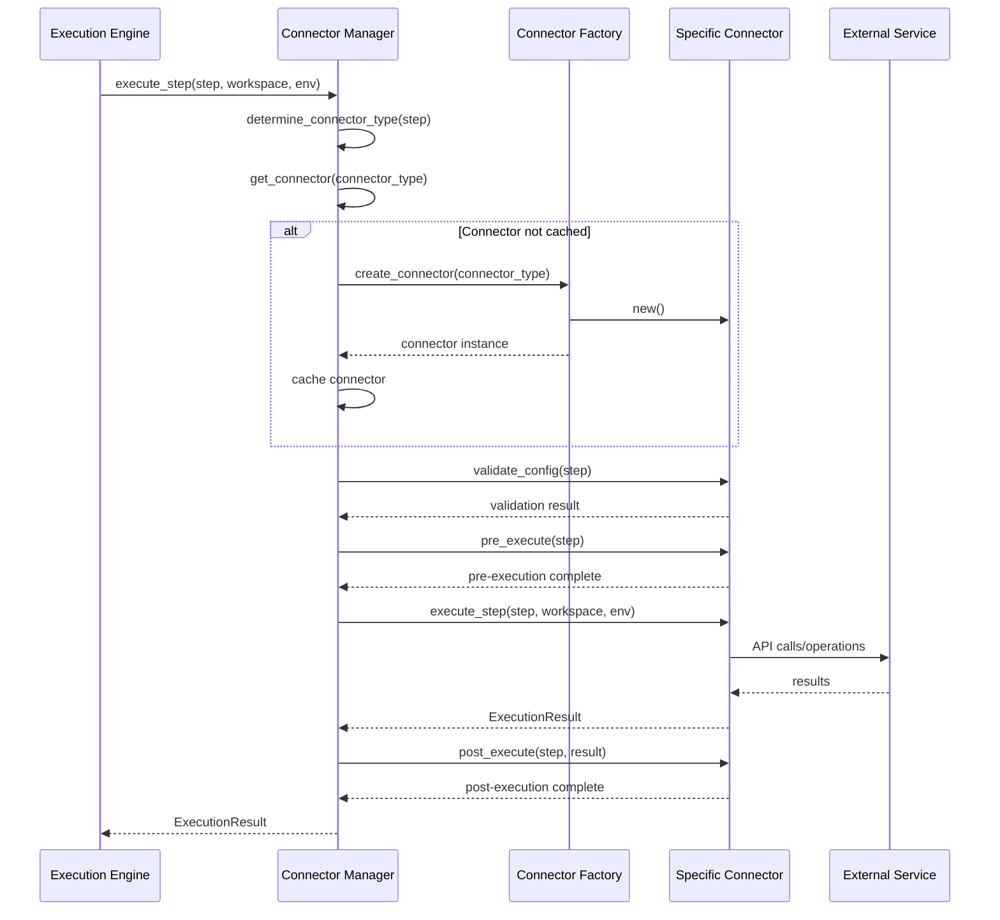

### Infrastructure Layer

#### File System Manager
- **Purpose**: Manage workspace and artifact storage
- **Operations**:
  - Workspace creation and cleanup
  - Artifact copying and archiving
  - Temporary file management
  - Permission handling

#### Lifecycle Hook Manager
- **Purpose**: Handle pre/post execution hooks for Kubernetes
- **Features**:
  - MongoDB integration for tracking
  - Metrics collection
  - Failure tracking
  - Custom hook execution

#### YAML Generator
- **Purpose**: Generate Kubernetes Job YAML configurations
- **Features**:
  - Dynamic YAML generation
  - Template-based configuration
  - Validation and syntax checking
  - Resource optimization

#### Configuration Validator
- **Purpose**: Validate connector configurations
- **Features**:
  - Step configuration validation
  - Resource format validation
  - Connectivity checks
  - Permission validation

## Request Flow Patterns

### Pipeline Creation Flow

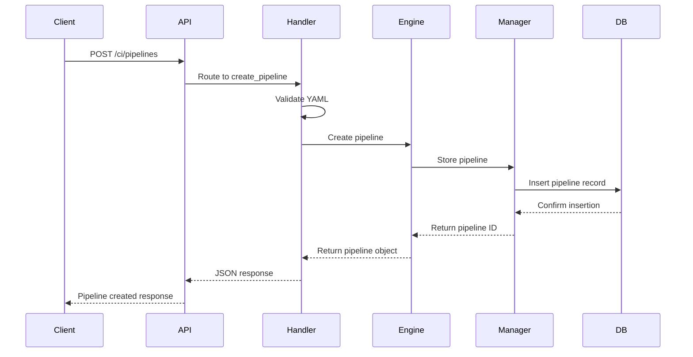

### Pipeline Execution Flow

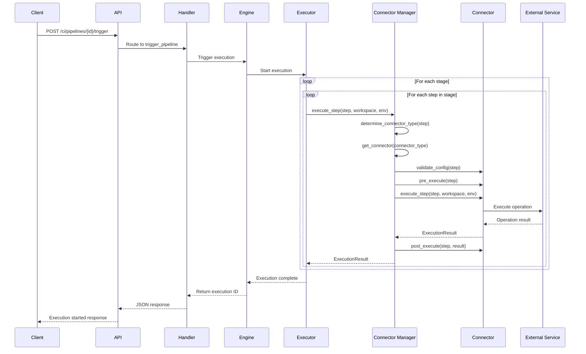

### File Upload Flow

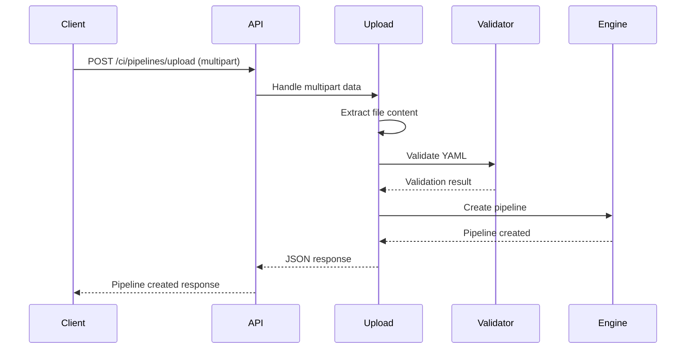

## Data Models

### Core Entities

#### Pipeline
```rust
pub struct CIPipeline {
    pub id: Option<Uuid>,
    pub name: String,
    pub description: Option<String>,
    pub triggers: Vec<Trigger>,
    pub stages: Vec<Stage>,
    pub environment: HashMap<String, String>,
    pub timeout: u64,
    pub retry_count: u32,
    pub created_at: Option<DateTime<Utc>>,
    pub updated_at: Option<DateTime<Utc>>,
}
```

#### Execution
```rust
pub struct PipelineExecution {
    pub id: Uuid,
    pub pipeline_id: Uuid,
    pub status: ExecutionStatus,
    pub trigger_info: TriggerInfo,
    pub started_at: Option<DateTime<Utc>>,
    pub finished_at: Option<DateTime<Utc>>,
    pub duration: Option<u64>,
    pub stages: Vec<StageExecution>,
    pub logs: Vec<String>,
}
```

#### Deployment Result
```rust
pub struct DeploymentResult {
    pub deployment_id: Uuid,
    pub deployment_type: DeploymentType,
    pub status: DeploymentStatus,
    pub artifacts: Vec<DeploymentArtifact>,
    pub services: Vec<DeployedService>,
    pub logs: Vec<String>,
}
```

## Database Schema

### Collections

#### pipelines
```json
{
  "_id": "ObjectId",
  "id": "UUID",
  "name": "String",
  "description": "String",
  "yaml_content": "String",
  "triggers": "Array",
  "stages": "Array",
  "environment": "Object",
  "timeout": "Number",
  "retry_count": "Number",
  "created_at": "Date",
  "updated_at": "Date"
}
```

#### executions
```json
{
  "_id": "ObjectId",
  "id": "UUID",
  "pipeline_id": "UUID",
  "status": "String",
  "trigger_info": "Object",
  "started_at": "Date",
  "finished_at": "Date",
  "duration": "Number",
  "stages": "Array",
  "logs": "Array",
  "environment": "Object"
}
```

#### services
```json
{
  "_id": "ObjectId",
  "id": "UUID",
  "name": "String",
  "service_type": "String",
  "endpoint": "String",
  "deployment_id": "UUID",
  "container_id": "String",
  "process_id": "Number",
  "status": "String",
  "ports": "Array",
  "last_heartbeat": "Date",
  "metadata": "Object"
}
```

## Security Architecture

### Authentication Flow
1. Client requests OAuth authorization
2. GitHub OAuth callback provides authorization code
3. Server exchanges code for access token
4. Server generates JWT token
5. Client uses JWT for subsequent requests

### Security Measures
- JWT token expiration and refresh
- Input validation and sanitization
- File upload size and type restrictions
- Docker container isolation
- Environment variable encryption
- Rate limiting and DDoS protection

## Performance Considerations

### Async Architecture
- Tokio async runtime for non-blocking I/O
- Connection pooling for database operations
- Concurrent pipeline execution
- Streaming responses for large data

### Caching Strategy
- Pipeline configuration caching
- Execution status caching
- Docker image layer caching
- Git repository caching

### Resource Management
- Workspace cleanup after execution
- Container lifecycle management
- Port allocation and deallocation
- Memory usage monitoring

## Scalability Design

### Horizontal Scaling
- Stateless application design
- Database connection pooling
- Load balancer compatibility
- Session storage externalization

### Vertical Scaling
- Efficient memory usage
- CPU-intensive task optimization
- I/O operation optimization
- Resource monitoring and alerting

## Error Handling Strategy

### Error Categories
1. **Validation Errors**: Invalid input data
2. **Authentication Errors**: Authorization failures
3. **External Service Errors**: GitHub, Docker, SSH failures
4. **Internal Errors**: Database, file system issues
5. **Timeout Errors**: Long-running operation failures

### Error Response Format
```json
{
  "error": "ErrorType",
  "message": "Human-readable message",
  "details": "Additional context",
  "suggestions": ["Actionable suggestions"],
  "timestamp": "ISO 8601 timestamp"
}
```

## Monitoring and Observability

### Logging
- Structured logging with tracing crate
- Log levels: ERROR, WARN, INFO, DEBUG, TRACE
- Request/response logging
- Performance metrics logging

### Metrics
- Request latency and throughput
- Pipeline execution times
- Resource utilization
- Error rates and types

### Health Checks
- Application health endpoint
- Database connectivity check
- External service availability
- Resource usage monitoring

## Potential Improvements & Future Enhancements

Based on the current connector system architecture, here are identified areas for improvement and future development:

### 1. Connector System Enhancements

#### Dynamic Plugin System
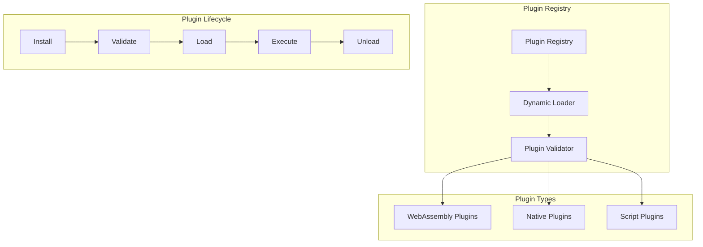

**Improvements:**
- **WebAssembly Plugin Support**: Enable WASM-based connectors for security and portability
- **Hot Plugin Reloading**: Update connectors without system restart
- **Plugin Marketplace**: Centralized repository for community connectors
- **Plugin Sandboxing**: Isolated execution environment for third-party plugins
- **Plugin Versioning**: Support multiple versions of the same connector

#### Advanced Connector Features
- **Connector Composition**: Chain multiple connectors for complex workflows
- **Conditional Execution**: Smart connector selection based on runtime conditions
- **Parallel Connector Execution**: Execute multiple connectors simultaneously
- **Connector Health Monitoring**: Real-time health checks and failover
- **Resource Pooling**: Shared resources across connector instances

### 2. Enhanced Kubernetes Integration

#### Advanced Kubernetes Features
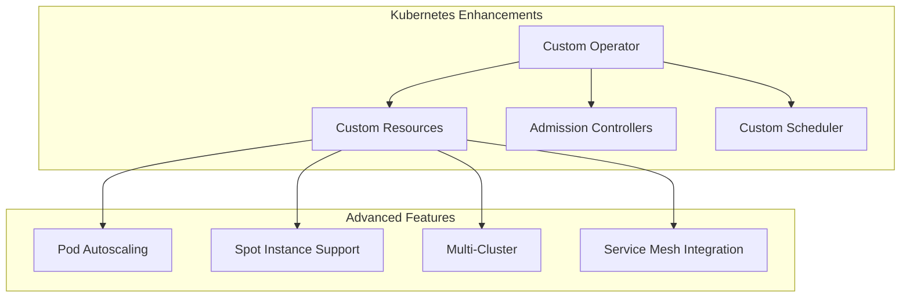

**Improvements:**
- **Custom Kubernetes Operator**: Native Kubernetes integration with CRDs
- **Pod Autoscaling**: Dynamic scaling based on workload
- **Spot Instance Support**: Cost optimization with preemptible instances
- **Multi-Cluster Deployment**: Execute across multiple Kubernetes clusters
- **Service Mesh Integration**: Istio/Linkerd integration for observability
- **GPU/TPU Support**: Specialized hardware for ML/AI workloads

### 3. Advanced Monitoring & Observability

#### Comprehensive Observability Stack
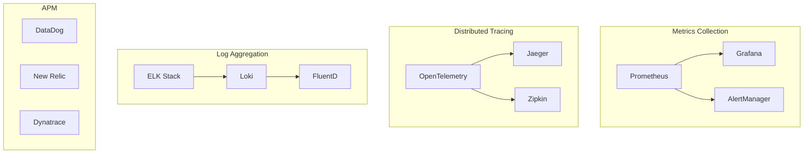

**Improvements:**
- **Distributed Tracing**: End-to-end request tracing across connectors
- **Custom Metrics**: Connector-specific performance metrics
- **Predictive Analytics**: ML-based failure prediction
- **Cost Analytics**: Resource usage and cost optimization insights
- **SLA Monitoring**: Service level agreement tracking and alerting

### 4. Security & Compliance Enhancements

#### Zero-Trust Security Model
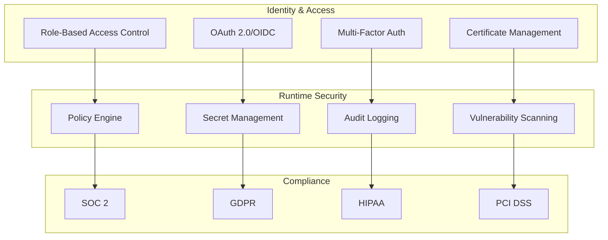

**Improvements:**
- **Policy as Code**: OPA (Open Policy Agent) integration
- **Secret Rotation**: Automatic credential rotation
- **Vulnerability Scanning**: Container and dependency scanning
- **Compliance Automation**: Automated compliance reporting
- **Zero-Trust Networking**: Network segmentation and micro-segmentation

### 5. Performance & Scalability Improvements

#### High-Performance Architecture
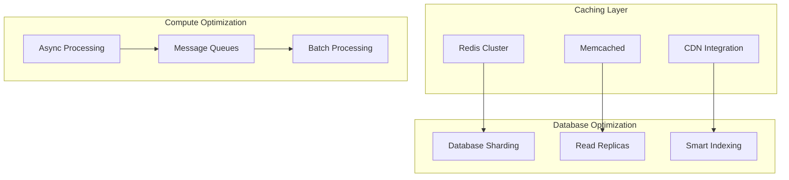

**Improvements:**
- **Intelligent Caching**: Multi-level caching with cache invalidation
- **Database Optimization**: Query optimization and connection pooling
- **Async Processing**: Non-blocking operations throughout the stack
- **Resource Prediction**: ML-based resource allocation
- **Edge Computing**: Distributed execution nodes

### 6. Developer Experience Enhancements

#### Modern Development Tools
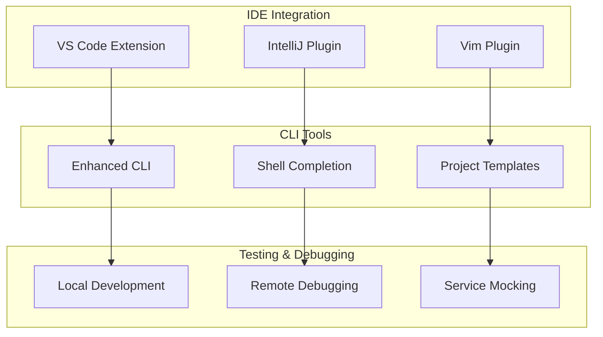

**Improvements:**
- **IDE Integration**: Rich IDE plugins with syntax highlighting and debugging
- **Local Development Mode**: Run pipelines locally for testing
- **Pipeline Visualization**: Interactive pipeline flow diagrams
- **Template Library**: Pre-built pipeline templates for common use cases
- **Configuration Validation**: Real-time YAML validation and suggestions

### 7. Agent-Based Architecture Evolution

#### Distributed Agent System
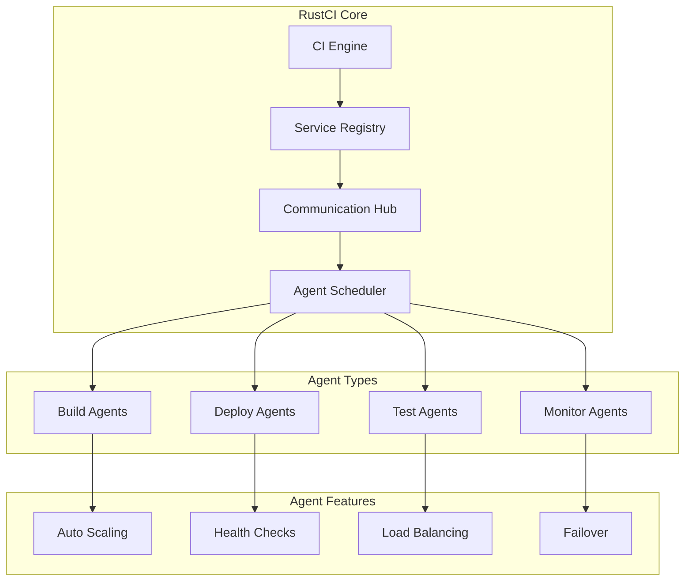

**Improvements:**
- **Specialized Agents**: Purpose-built agents for specific tasks
- **Agent Auto-Discovery**: Automatic agent registration and discovery
- **Dynamic Load Balancing**: Intelligent workload distribution
- **Agent Health Management**: Automatic failover and recovery
- **Edge Agent Deployment**: Agents in edge locations for reduced latency

### 8. Cloud-Native & Multi-Cloud Support

#### Multi-Cloud Strategy
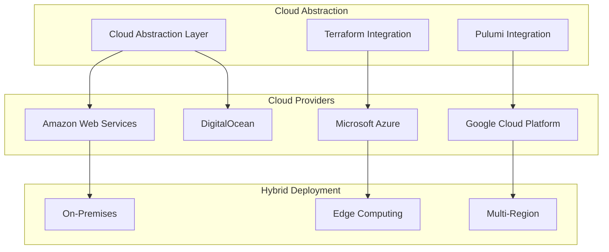

**Improvements:**
- **Cloud Abstraction Layer**: Unified API across cloud providers
- **Infrastructure as Code**: Terraform/Pulumi integration
- **Multi-Cloud Deployment**: Deploy across multiple cloud providers
- **Cost Optimization**: Automatic cloud resource optimization
- **Disaster Recovery**: Cross-cloud backup and recovery

### 9. AI/ML Integration

#### Intelligent Pipeline Management
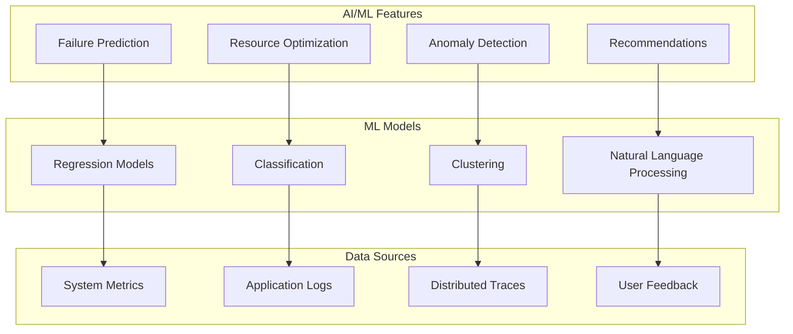

**Improvements:**
- **Predictive Analytics**: ML-based failure and performance prediction
- **Intelligent Resource Allocation**: AI-driven resource optimization
- **Automated Troubleshooting**: AI-powered error diagnosis and resolution
- **Natural Language Queries**: Query pipelines and logs using natural language
- **Continuous Learning**: Self-improving system based on historical data

### 10. Implementation Roadmap

#### Phase 1: Foundation (Q1-Q2)
- Enhanced connector plugin system
- Advanced Kubernetes features
- Improved monitoring and observability

#### Phase 2: Intelligence (Q3-Q4)
- AI/ML integration
- Predictive analytics
- Automated optimization

#### Phase 3: Scale (Year 2)
- Multi-cloud support
- Agent-based architecture
- Enterprise features

#### Phase 4: Innovation (Year 3+)
- Edge computing integration
- Advanced security features
- Next-generation developer tools

These improvements will transform RustCI from a high-performance CI/CD platform into an intelligent, self-optimizing, and highly scalable DevOps ecosystem.