# Yggdrasil Cache System — Production-Ready Architecture Brief (AI-First Edition)

## TL;DR Executive Summary

**Yggdrasil** is a distributed, AI-optimized cache delivering DRAM-grade latency (50-200ns hot reads) with rich programmability and cost-efficient durability. Built on shard-per-core architecture with hardware acceleration (FPGA, RDMA, SmartNIC) and native support for large embeddings, vector operations, and model serving workloads.

**Elevator Pitch**: Redis-compatible cache with 10x lower tail latency for AI workloads through hardware-accelerated admission control, zero-copy streaming, and burst-tolerant QoS.

**One-line Risk**: Requires RDMA-capable hardware and PMem for full performance; software fallbacks increase latency by 2-5x.

---

## Assumptions & Tradeoffs

- **L0 (core-local DRAM) required for sub-µs decisions** — hot state must fit in allocated DRAM  
- **Predictive placement and heavy inference run off-FPGA** on CPU/DPU (ms latency budget)  
- **RDMA and FPGA acceleration are optional** — software fallback exists  
- **Per-user state pinned to cores** for strong per-user consistency; cross-shard ops are eventual or use 2PC

---

## System Architecture Diagram

```mermaid
flowchart LR
  %% Client Layer
  subgraph Client["Client Applications & AI Workloads"]
    direction TB
    Q["Redis/RESP Clients\n• TryConsume (rate limit)\n• Get/Set/Pipeline\n• GET_STREAM for large objects\n• PIN/UNPIN semantics\n• Batch operations for embeddings"]
  end

  %% Frontend & Routing Layer
  subgraph Frontend["Ingress / Protocol Layer"]
    direction TB
    RESP["RESP Gateway\n• SO_REUSEPORT per-shard\n• TLS termination\n• Auth/ACL mapping\n• Connection distribution"]
    Router["Key Router & Sharder\n• Consistent Hash + vnodes\n• Affinity routing\n• Load balancing"]
  end

  %% Core Node Architecture
  subgraph Node["Yggdrasil Node (Shard-per-core Data Plane)"]
    direction TB
    
    subgraph Hot["Per-Core Shards (Hot Path)"]
      direction LR
      Sockets["Per-Core Accept\n(SO_REUSEPORT)"]
      S1["Shard/Core 1\n• CAS-based Token Buckets\n• SoA KV Arena + fingerprints\n• W-TinyLFU admission\n• Zero-copy reads\n• PIN/UNPIN tracking\n• QoS per-model budgets"]
      S2["Shard/Core N\n• CAS-based Token Buckets\n• SoA KV Arena + fingerprints\n• W-TinyLFU admission\n• Zero-copy reads\n• PIN/UNPIN tracking\n• QoS per-model budgets"]
    end

    subgraph Wasm["wBPF/Wasm Runtime"]
      direction TB
      WASM1["Per-shard Wasm Instance\n• pre/post hooks\n• Resource quotas\n• Policy validation"]
      WASMN["Per-shard Wasm Instance\n• Transform functions\n• Custom logic"]
    end

    subgraph LocalPersist["Near-Memory Storage & Streaming"]
      direction TB
      MMAP["mmap Append Log\n(PMem emulation)"]
      PMEM["PMem/DAX Storage\n• libpmem2 integration\n• Persistent allocator\n• Large object chunking"]
      CXL["CXL Warm Pool\n• Capacity extension\n• Higher/variable latency than DRAM\n• Characterize on target hardware\n• Vector embeddings storage"]
      NVME["NVMe Fallback\n• io_uring/SPDK\n• Cold storage\n• Streaming API support"]
      STREAM["Streaming Engine\n• GET_STREAM chunked reads\n• Zero-copy to accelerators\n• Large object assembly"]
    end

    subgraph Background["Background Services"]
      direction TB
      WALAPP["WAL Append Worker\n• Group commits\n• Versioned commit markers\n• Checksums & metadata\n• Quota-limited"]
      SNAP["Snapshot Manager\n• Background uploads\n• Incremental sync"]
      COMPACT["Compaction Engine\n• COW segment rotation\n• GC policies"]
      REPAIR["Repair & Verify\n• Checksum validation\n• Slice reconstruction"]
    end
  end

  %% Replication & Consistency Layer
  subgraph Replication["Replication & Consistency"]
    direction TB
    POL["Policy Engine\n• Hotness detection\n• RF vs EC mapping\n• Tier placement\n• AI workload prioritization"]
    REPLICA["Replication Pipeline\n• Per-shard primary semantics\n• RDMA WRITE + CAS atomics\n• WAL ordering coordination\n• Software fallback for non-RDMA"]
    NIC["SmartNIC + RDMA\n• One-sided RDMA verbs\n• Hardware acceleration\n• NIC-level caching\n• RDMA atomic operations"]
  end

  %% Storage & Durability Tiers
  subgraph Storage["Multi-Tier Storage"]
    direction TB
    HOTDRAM["DRAM Tier (Hot)\n• 50-200ns latency\n• Limited capacity\n• PIN/UNPIN support"]
    WARMTIER["Warm Tier\n• Higher/variable latency than DRAM\n• Characterize on target hardware\n• Vector embedding storage"]
    COLDOBJ["Cold Object Store\n• S3-compatible\n• Erasure coded (k,m)\n• Cost optimized\n• Large object chunking"]
    SNAPSTORE["Snapshot Storage\n• Periodic checkpoints\n• Recovery points"]
  end

  %% Erasure Coding Pipeline
  subgraph Erasure["Erasure Coding Pipeline"]
    direction TB
    ENCODER["Reed-Solomon Encoder\n• (k,m) parameters\n• Parallel slice creation\n• FPGA offload capable"]
    DECODER["Slice Decoder\n• Reconstruction logic\n• Missing slice repair\n• Hardware acceleration"]
    OBJMGR["Object Manager\n• Slice metadata (version/checksum)\n• Commit marker tracking\n• Safe partial-write handling"]
  end

  %% Hardware Acceleration & Offload
  subgraph Hardware["Hardware Acceleration Pipeline"]
    direction TB
    FPGA["FPGA Boosters\n• Reed-Solomon encode/decode\n• Crypto operations\n• Custom compute kernels\n• Pluggable acceleration"]
    CXLCHAN["CXL Channeling\n• Direct memory access\n• Low-latency data movement\n• Bypass CPU for bulk ops"]
    HWDECISION["HW Offload Decision\n• Workload profiling\n• Cost/benefit analysis\n• Dynamic offload routing"]
  end

  %% AI & Large Object Support
  subgraph AISupport["AI Workload Support"]
    direction TB
    QOS["QoS & Admission Control\n• Per-model token budgets\n• Priority queues (HIGH/NORMAL/LOW)\n• RATE_LIMITED responses\n• Burst tolerance for inference"]
    VECTOR["Vector Operations\n• Embedding storage\n• ANN hooks\n• Batch multi-get support\n• Large value optimization"]
    PINNING["PIN/UNPIN Semantics\n• L0 residency guarantees\n• TTL-based eviction protection\n• Critical model caching"]
  end

  %% Control & Observability
  subgraph Control["Control Plane & Observability"]
    direction TB
    METRICS["Metrics Collection\n• Prometheus export\n• Per-shard telemetry\n• Latency histograms"]
    ADMIN["Admin API\n• Reshard operations (snapshot+WAL stream)\n• Node add/remove with vnode transfer\n• Cluster management\n• Role-based access control"]
    AUDIT["Audit & Security\n• Access logging\n• Wasm signature validation\n• TLS enforcement"]
  end

  %% Primary Data Flow Connections
  Q -->|RESP Protocol| RESP
  RESP --> Router
  Router -->|Hash routing| Sockets
  Sockets --> S1
  Sockets --> S2

  %% Shard to Wasm Integration
  S1 <==> WASM1
  S2 <==> WASMN
  
  %% Wasm to Policy Engine Integration (bidirectional)
  WASM1 <==>|Policy influence| POL
  WASMN <==>|Hotness decisions| POL

  %% Storage Tier Connections
  S1 --> HOTDRAM
  S2 --> HOTDRAM
  S1 --> MMAP
  S2 --> MMAP
  MMAP --> PMEM
  MMAP --> CXL
  PMEM --> WARMTIER
  CXL --> WARMTIER

  %% AI Workload Integration
  S1 --> QOS
  S2 --> QOS
  S1 --> VECTOR
  S2 --> VECTOR
  S1 --> PINNING
  S2 --> PINNING
  PINNING --> HOTDRAM
  VECTOR --> CXL
  QOS --> POL
  
  %% Streaming and Large Object Flows
  S1 --> STREAM
  S2 --> STREAM
  STREAM --> PMEM
  STREAM --> CXL
  STREAM --> NVME

  %% WAL and Replication Pipeline
  S1 -->|WAL writes| WALAPP
  S2 -->|WAL writes| WALAPP
  WALAPP --> REPLICA
  REPLICA --> NIC
  NIC -->|Policy feedback| POL
  POL --> REPLICA

  %% Background Process Flows
  WALAPP --> Background
  Background --> SNAP
  Background --> COMPACT  
  Background --> REPAIR
  SNAP --> SNAPSTORE
  REPAIR --> DECODER

  %% Erasure Coding Integration
  POL -->|Cold tier policy| ENCODER
  ENCODER --> OBJMGR
  OBJMGR --> COLDOBJ
  COLDOBJ --> DECODER
  DECODER --> REPAIR

  %% Hardware Acceleration Integration
  HWDECISION --> FPGA
  HWDECISION --> CXLCHAN
  FPGA --> ENCODER
  FPGA --> DECODER
  CXLCHAN --> CXL
  CXLCHAN --> WARMTIER
  NIC -->|Offload decision| HWDECISION

  %% Observability Connections
  S1 --> METRICS
  S2 --> METRICS
  WALAPP --> METRICS
  REPLICA --> METRICS
  Background --> METRICS
  QOS --> METRICS
  METRICS --> ADMIN
  ADMIN --> Control

  %% Recovery and Repair Flows
  REPAIR --> WALAPP
  SNAPSTORE -->|Recovery| Background
  COLDOBJ -->|Repair reads| DECODER

  %% Fallback Paths
  PMEM -.->|Fallback| NVME
  CXL -.->|Degraded mode| NVME
  NIC -.->|Software fallback| REPLICA
  
  %% Hardware Fallback Paths
  FPGA -.->|Software fallback| ENCODER
  CXLCHAN -.->|CPU fallback| WARMTIER

  %% Styling for Visual Clarity
  style Hot fill:#0d9488,stroke:#fff,color:#fff,stroke-width:2px
  style Replication fill:#0369a1,stroke:#fff,color:#fff,stroke-width:2px
  style Storage fill:#6b7280,stroke:#fff,color:#fff,stroke-width:2px
  style Erasure fill:#dc2626,stroke:#fff,color:#fff,stroke-width:2px
  style Node fill:#111827,stroke:#fff,color:#fff,stroke-width:3px
  style Client fill:#2563eb,stroke:#fff,color:#fff,stroke-width:2px
  style Frontend fill:#0891b2,stroke:#fff,color:#fff,stroke-width:2px
  style Wasm fill:#8b5cf6,stroke:#fff,color:#fff,stroke-width:2px
  style LocalPersist fill:#ea580c,stroke:#fff,color:#fff,stroke-width:2px
  style Background fill:#7c3aed,stroke:#fff,color:#fff,stroke-width:2px
  style Hardware fill:#dc2626,stroke:#fff,color:#fff,stroke-width:2px
  style Control fill:#a855f7,stroke:#fff,color:#fff,stroke-width:2px
  style AISupport fill:#059669,stroke:#fff,color:#fff,stroke-width:2px
```



---

## Core Design Principles

**Linear Core Scalability**: Shard-per-core architecture with single-threaded shards eliminates locks and contention, enabling predictable performance scaling.

**AI-First Architecture**: Native support for large embeddings, vector operations, burst-tolerant QoS, and PIN/UNPIN semantics for inference-critical models.

**Hardware-Accelerated Fast Path**: CAS-based token buckets, RDMA replication, and FPGA offloads for sub-microsecond hot path operations.

**Cost-Efficient Durability**: Hot replication for latency-critical data, erasure coding (k,m) for cold tier cost optimization.

**Zero-Copy Streaming**: GET_STREAM API for large objects with chunking and direct-to-accelerator data paths.

---

## Atomicity & Remote Replication (CAS + RDMA)

**CAS + RDMA for global atomicity**

Local atomic operations use hardware CAS for per-core lock-free structures. Cross-node replication and global counters use one-sided RDMA verbs and RDMA atomics (CAS, fetch-and-add) to avoid kernel round trips — with software fallback for non-RDMA environments.

*Example flow:* Leader issues RDMA WRITE of a log entry to follower log buffer and then an RDMA CAS on the follower's tail pointer to atomically advance the committed tail. If CAS fails, leader retries with updated expected value.

**Security Considerations**: RDMA requires careful permission management and network isolation. Production deployments should use RDMA over Converged Ethernet (RoCE) with proper VLAN segmentation.

---

## AI Workloads — Requirements & Design Considerations

Yggdrasil targets caching/storage for large-scale AI model serving and training: large-value support (chunking, zero-copy streaming), native vector primitives + ANN hooks, burst-tolerant QoS, and pin/unpin semantics for inference-critical models.

**Key Requirements**:
- **Large Values**: Support for multi-MB embeddings and model weights through chunking
- **Vector Operations**: Native ANN hooks and batch operations for similarity search
- **Burst Tolerance**: QoS admission control handles 10x inference spikes without degradation
- **Consistency vs Latency**: Configurable per-model consistency (eventual vs strong reads)

---

## Large-object & Streaming API

**Large-object primitives**
- Chunked values (configurable chunk size, default 64KB)
- `GET_STREAM(key, offset, length)` for zero-copy streaming into accelerator buffers
- `PIN(key)` / `UNPIN(key)` to guarantee L0 residency for a TTL

**Rust client example (streaming GET)**
```rust
async fn stream_get(client: &YggdrasilClient, key: &str, mut out: impl AsyncWrite) -> Result<(), Error> {
    let mut offset = 0;
    loop {
        let chunk = client.get_stream(key, offset, CHUNK_SIZE).await?;
        if chunk.is_empty() { break; }
        out.write_all(&chunk).await?;
        offset += chunk.len() as u64;
    }
    Ok(())
}
```

---

## Client Acknowledgement Modes

**Fast (Write-Behind)**: Client ACK after WAL append and in-memory storage (default). Group commits scheduled asynchronously. Risk: recent writes may be lost on immediate crash (< 1 second window).

**Strong (Semi-Sync)**: Client ACK after N-1 replicas confirm WAL receipt. Ensures write survives single node failure.

**Sync**: Client ACK after physical persistence on local PMem or confirmed fsync on remote replicas. Highest durability guarantee.

Operators configure per-namespace based on SLA requirements and latency tolerance.

---

## QoS & Admission Control for Model Serving

Per-model and per-tenant token-bucket budgets, request prioritization (HIGH/NORMAL/LOW), and degradation strategies returning `RATE_LIMITED` with `retry_after_ms` and optional fallback cues.

**Implementation**: Hardware CAS-based token buckets per shard with configurable burst tolerance. During 10x inference spikes, system maintains P99 latency by selectively degrading low-priority requests.

**Per-Model Budgets**: Configure separate quotas for different models based on computational cost and business priority.

---

## Performance Targets (with Assumptions)

| Operation | P50 Latency | P99 Latency | Assumptions |
|-----------|-------------|-------------|-------------|
| Hot GET (DRAM) | 50-200ns | 1-3µs | 80% DRAM hit rate, single-word values |
| Warm GET (PMem/CXL) | 1-10µs | 50µs | PMem DAX mode, 64B-4KB values |
| Cold GET (Reconstruct) | 1-10ms | 50ms | k=6,m=3 EC, network