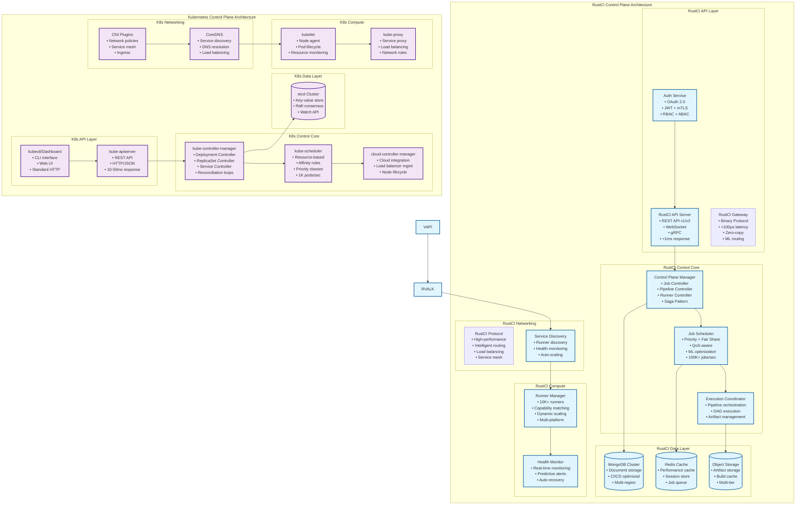
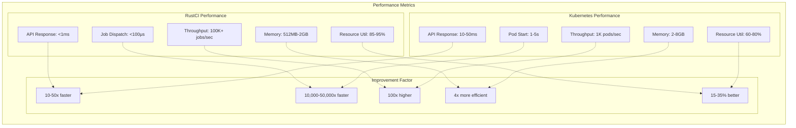
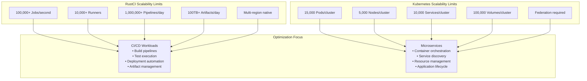
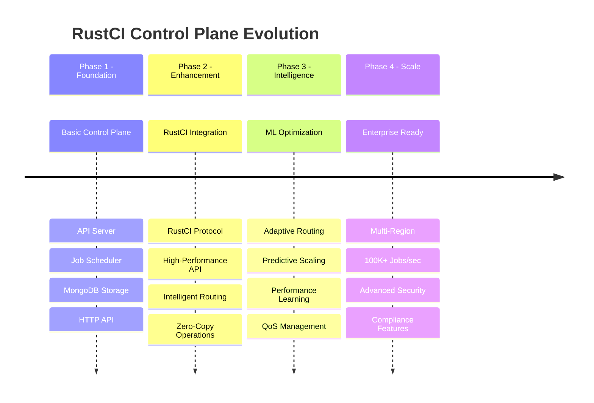
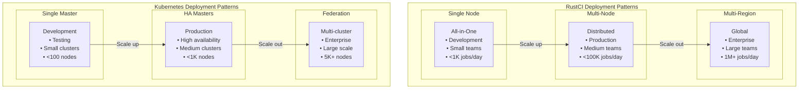

# RustCI vs Kubernetes Control Plane - Visual Comparison

## Side-by-Side Architecture Comparison

## Performance Comparison Matrix

## Scalability Comparison

## Component Evolution Timeline

## Deployment Patterns Comparison

## Key Architectural Differences Summary

| Aspect | RustCI | Kubernetes | Impact |
|--------|--------|------------|--------|
| **Primary Workload** | CI/CD Pipelines | Microservices | Specialized vs General Purpose |
| **API Protocol** | Binary + REST | REST/gRPC | 10-50x performance improvement |
| **Storage Model** | Document (MongoDB) | Key-Value (etcd) | Better CI/CD metadata handling |
| **Scheduling Focus** | Job-centric | Pod-centric | CI/CD-aware resource allocation |
| **Network Protocol** | RustCI (custom) | Standard TCP/HTTP | Sub-100μs communication |
| **Resource Model** | Runner-based | Node-based | CI/CD capability matching |
| **State Management** | Pipeline-aware | Container-aware | Workflow state optimization |
| **Scaling Model** | Job throughput | Pod density | 100x higher job processing |

This architecture comparison demonstrates how RustCI's control plane is specifically optimized for CI/CD workloads while maintaining the proven patterns and reliability of Kubernetes-style orchestration.