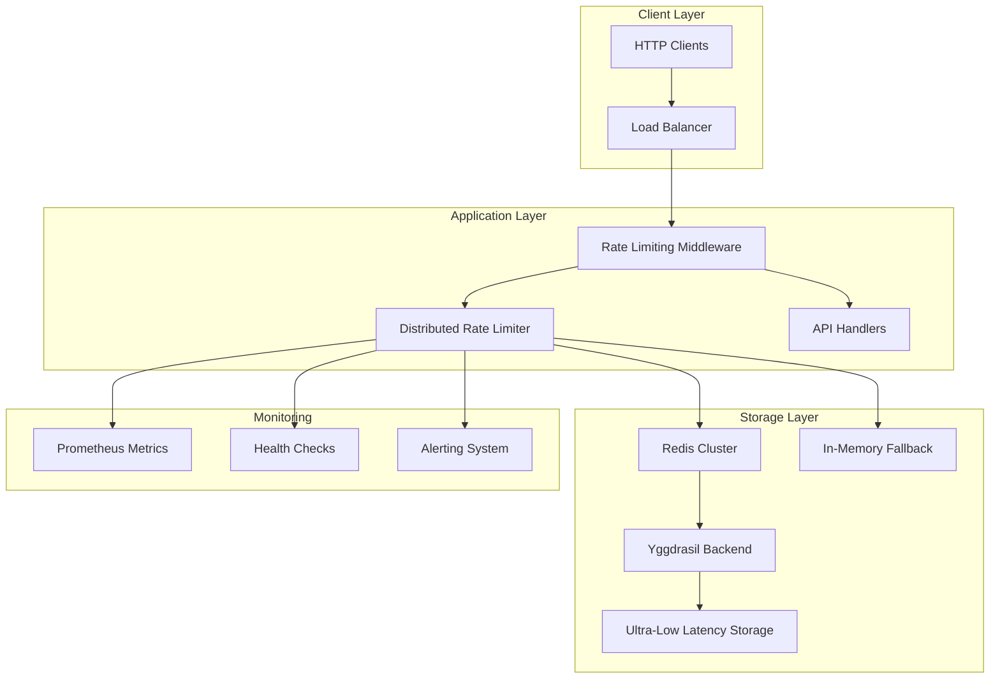

# Distributed Rate Limiting System

## Overview

The Distributed Rate Limiting System provides enterprise-grade rate limiting with Redis backend support, configurable policies per endpoint and user, and comprehensive rate limit headers with client guidance. This system is designed to handle high-throughput scenarios while maintaining low latency and high availability.

**Note**: This is currently a placeholder implementation that will be replaced by Yggdrasil storage backend for ultra-low latency (<20µs P99) distributed rate limiting operations.

## Features

### Core Capabilities

- **Distributed Architecture**: Redis-backed rate limiting with automatic fallback to in-memory storage
- **Configurable Policies**: Per-endpoint, per-user, per-IP, and custom scope rate limiting
- **High Performance**: Optimized for low-latency operations with connection pooling
- **Fault Tolerance**: Automatic fallback mechanisms and circuit breaker patterns
- **Comprehensive Monitoring**: Real-time statistics, health checks, and performance metrics
- **Production Ready**: Enterprise-grade configuration management and observability

### Policy Scopes

1. **Per-IP**: Rate limiting based on client IP address
2. **Per-User**: Rate limiting for authenticated users
3. **Per-API-Key**: Rate limiting based on API key
4. **Per-Endpoint**: Rate limiting for specific API endpoints
5. **Global**: System-wide rate limiting
6. **Custom**: Pattern-based rate limiting with custom rules

## Architecture



## Configuration

### Basic Configuration

```rust
use RustAutoDevOps::core::security::rate_limiter::{
    DistributedRateLimiter, DistributedRateLimitConfig
};

let config = DistributedRateLimitConfig {
    redis_url: Some("redis://localhost:6379".to_string()),
    pool_size: 10,
    connection_timeout_ms: 5000,
    command_timeout_ms: 1000,
    cluster_mode: false,
    key_prefix: "rustci:ratelimit".to_string(),
    default_ttl_seconds: 3600,
    enable_compression: false,
    fallback_to_memory: true,
    health_check_interval_seconds: 30,
};

let limiter = DistributedRateLimiter::new(config).await?;
```

### Production Configuration

```rust
let production_config = DistributedRateLimitConfig {
    redis_url: Some("redis://redis-cluster.prod.example.com:6379".to_string()),
    pool_size: 20,
    connection_timeout_ms: 3000,
    command_timeout_ms: 1000,
    cluster_mode: true,
    key_prefix: "rustci:prod:ratelimit".to_string(),
    default_ttl_seconds: 7200, // 2 hours
    enable_compression: true,
    fallback_to_memory: true,
    health_check_interval_seconds: 30,
};
```

## Policy Management

### Creating Rate Limiting Policies

```rust
use RustAutoDevOps::core::security::rate_limiter::{
    RateLimitPolicy, PolicyScope
};
use std::collections::HashMap;

// API endpoint policy
let api_policy = RateLimitPolicy {
    name: "api_v2_endpoints".to_string(),
    limit: 1000,
    window_seconds: 3600,
    burst_limit: Some(100),
    priority: 2,
    scope: PolicyScope::PerEndpoint,
    custom_headers: {
        let mut headers = HashMap::new();
        headers.insert("X-RateLimit-Policy".to_string(), "api_v2".to_string());
        headers
    },
    enabled: true,
};

limiter.add_policy(api_policy).await?;

// User-based policy
let user_policy = RateLimitPolicy {
    name: "premium_users".to_string(),
    limit: 5000,
    window_seconds: 3600,
    burst_limit: Some(200),
    priority: 3,
    scope: PolicyScope::PerUser,
    custom_headers: HashMap::new(),
    enabled: true,
};

limiter.add_policy(user_policy).await?;
```

### Policy Priority System

Policies are evaluated in priority order (higher number = higher priority):

1. **Priority 3**: Per-API-Key policies (most specific)
2. **Priority 2**: Per-User policies
3. **Priority 1**: Per-Endpoint policies
4. **Priority 0**: Global policies (least specific)

The most restrictive policy that applies to a request determines the rate limit.

## Usage Examples

### Basic Rate Limiting

```rust
use RustAutoDevOps::api::rate_limiting::{RateLimitResult, RateLimiter};

// Simple rate limiting check
let result = limiter.check_rate_limit("user:123", 100, 3600).await?;

match result {
    RateLimitResult::Allowed { remaining, limit, reset_time } => {
        println!("Request allowed: {}/{} remaining", remaining, limit);
    }
    RateLimitResult::Exceeded { limit, retry_after_seconds, .. } => {
        println!("Rate limited: retry after {}s", retry_after_seconds);
    }
}
```

### Context-Based Rate Limiting

```rust
use RustAutoDevOps::core::security::rate_limiter::RateLimitContext;
use uuid::Uuid;

let context = RateLimitContext {
    client_ip: "192.168.1.100".to_string(),
    method: "POST".to_string(),
    endpoint: "/api/v2/pipelines".to_string(),
    user_id: Some("user123".to_string()),
    user_role: Some("premium".to_string()),
    api_key: Some("api_key_456".to_string()),
    request_id: Some(Uuid::new_v4()),
    metadata: HashMap::new(),
};

let result = limiter.check_request_with_policies("request_key", &context).await?;
```

### HTTP Middleware Integration

```rust
use axum::{
    extract::{Request, State},
    middleware::Next,
    response::Response,
};

pub async fn rate_limiting_middleware(
    State(limiter): State<Arc<DistributedRateLimiter>>,
    req: Request,
    next: Next,
) -> Result<Response, ApiErrorResponse> {
    // Extract request context
    let context = extract_request_context(&req);
    
    // Check rate limit
    let result = limiter.check_request_with_policies(&context.client_ip, &context).await?;
    
    match result {
        RateLimitResult::Allowed { .. } => {
            let mut response = next.run(req).await;
            
            // Add rate limit headers
            add_rate_limit_headers(&mut response, &result);
            
            Ok(response)
        }
        RateLimitResult::Exceeded { retry_after_seconds, .. } => {
            Err(create_rate_limit_error(retry_after_seconds))
        }
    }
}
```

## Rate Limit Headers

The system automatically adds standard rate limiting headers to HTTP responses:

### Success Response Headers

```http
X-RateLimit-Limit: 1000
X-RateLimit-Remaining: 999
X-RateLimit-Reset: 1640995200
X-RateLimit-Policy: api_v2_endpoints
```

### Rate Limited Response Headers

```http
HTTP/1.1 429 Too Many Requests
X-RateLimit-Limit: 1000
X-RateLimit-Remaining: 0
X-RateLimit-Reset: 1640995200
Retry-After: 300
Content-Type: application/json

{
  "error": {
    "code": "RATE_LIMIT_EXCEEDED",
    "message": "Rate limit exceeded",
    "details": {
      "limit": 1000,
      "window_seconds": 3600,
      "retry_after_seconds": 300
    },
    "recovery_suggestions": [
      "Wait 300 seconds before retrying",
      "Implement exponential backoff",
      "Consider upgrading to a higher rate limit tier"
    ]
  }
}
```

## Monitoring and Observability

### Health Checks

```rust
// Get health status
let health = limiter.get_health_status().await;
println!("Redis available: {}", health.redis_available);
println!("Consecutive failures: {}", health.consecutive_failures);
println!("Total requests: {}", health.total_requests);
```

### Performance Statistics

```rust
// Get comprehensive statistics
let stats = limiter.get_comprehensive_stats().await;
println!("Total requests: {}", stats.total_requests);
println!("Redis requests: {}", stats.redis_requests);
println!("Fallback requests: {}", stats.fallback_requests);
println!("Average latency: {:.2}ms", stats.average_latency_ms);
println!("Active policies: {}", stats.active_policies);
```

### Prometheus Metrics

The system exposes the following Prometheus metrics:

```prometheus
# Request counters
rate_limiter_requests_total{backend="redis",result="allowed"}
rate_limiter_requests_total{backend="fallback",result="exceeded"}

# Latency histograms
rate_limiter_request_duration_seconds{backend="redis"}
rate_limiter_request_duration_seconds{backend="fallback"}

# Health metrics
rate_limiter_redis_available{instance="node1"}
rate_limiter_consecutive_failures{instance="node1"}

# Policy metrics
rate_limiter_policy_hits_total{policy="api_v2_endpoints"}
rate_limiter_active_policies{instance="node1"}
```

## Error Handling and Recovery

### Automatic Fallback

When Redis becomes unavailable, the system automatically falls back to in-memory rate limiting:

```rust
// Configure fallback behavior
let config = DistributedRateLimitConfig {
    fallback_to_memory: true,
    health_check_interval_seconds: 30,
    ..Default::default()
};
```

### Circuit Breaker Pattern

The system implements circuit breaker patterns to prevent cascade failures:

- **Closed**: Normal operation, requests go to Redis
- **Open**: Redis is unavailable, all requests use fallback
- **Half-Open**: Testing Redis availability with limited requests

### Error Recovery Strategies

1. **Exponential Backoff**: Automatic retry with increasing delays
2. **Health Monitoring**: Continuous health checks to detect recovery
3. **Graceful Degradation**: Fallback to in-memory when distributed storage fails
4. **Alert Integration**: Automatic alerting when failures exceed thresholds

## Performance Characteristics

### Current Implementation (In-Memory Fallback)

- **Latency**: ~1-5ms P99 for in-memory operations
- **Throughput**: ~10,000 requests/second per instance
- **Memory Usage**: ~1KB per active rate limit key
- **Scalability**: Single-node, no distributed coordination

### Future Implementation (Yggdrasil Backend)

- **Latency**: <20µs P99 for distributed operations
- **Throughput**: >100,000 requests/second per instance
- **Memory Usage**: Optimized with per-core shards and lock-free atomics
- **Scalability**: Distributed coordination with microsecond-level consistency

## Best Practices

### Policy Design

1. **Use Hierarchical Policies**: Start with global limits, add specific overrides
2. **Set Appropriate Burst Limits**: Allow short-term spikes while maintaining overall limits
3. **Monitor Policy Effectiveness**: Track hit rates and adjust limits based on usage patterns
4. **Test Fallback Scenarios**: Ensure graceful degradation when Redis is unavailable

### Performance Optimization

1. **Connection Pooling**: Use appropriate pool sizes for your workload
2. **Key Design**: Use consistent, predictable key patterns for better cache locality
3. **TTL Management**: Set appropriate TTLs to prevent memory leaks
4. **Monitoring**: Implement comprehensive monitoring and alerting

### Security Considerations

1. **Input Validation**: Validate all rate limiting keys and contexts
2. **DoS Protection**: Implement global rate limits to prevent abuse
3. **Authentication**: Ensure proper authentication before applying user-specific limits
4. **Audit Logging**: Log rate limiting decisions for security analysis

## Migration Guide

### From Basic Rate Limiting

```rust
// Before: Basic rate limiting
let basic_limiter = InMemoryRateLimiter::new();

// After: Distributed rate limiting
let config = DistributedRateLimitConfig::default();
let distributed_limiter = DistributedRateLimiter::new(config).await?;
```

### Configuration Migration

```rust
// Migrate existing rate limit configurations
let legacy_config = RateLimitConfig {
    default_limit: 1000,
    default_window_seconds: 3600,
    // ... other settings
};

// Convert to distributed configuration
let distributed_config = DistributedRateLimitConfig {
    redis_url: Some("redis://localhost:6379".to_string()),
    fallback_to_memory: true,
    // ... other settings
};
```

## Troubleshooting

### Common Issues

1. **Redis Connection Failures**
   - Check Redis connectivity and authentication
   - Verify network configuration and firewall rules
   - Monitor Redis server health and performance

2. **High Latency**
   - Check Redis server performance and memory usage
   - Verify network latency between application and Redis
   - Consider enabling compression for large payloads

3. **Memory Usage**
   - Monitor active key count and TTL settings
   - Implement key cleanup policies
   - Consider Redis memory optimization settings

### Debug Mode

Enable debug logging to troubleshoot issues:

```rust
// Enable debug logging
tracing_subscriber::fmt()
    .with_max_level(tracing::Level::DEBUG)
    .init();
```

### Health Check Endpoints

Implement health check endpoints for monitoring:

```rust
async fn rate_limiter_health() -> impl IntoResponse {
    let health = limiter.get_health_status().await;
    let stats = limiter.get_comprehensive_stats().await;
    
    Json(json!({
        "redis_available": health.redis_available,
        "total_requests": stats.total_requests,
        "average_latency_ms": stats.average_latency_ms,
        "active_policies": stats.active_policies
    }))
}
```

## Future Enhancements

### Yggdrasil Integration

The current implementation will be replaced with Yggdrasil storage backend:

- **Ultra-Low Latency**: <20µs P99 for try_consume operations
- **Lock-Free Architecture**: Per-core shards with atomic operations
- **eBPF Integration**: Kernel-level rate limiting for maximum performance
- **DPDK Support**: User-space networking for minimal latency

### Advanced Features

- **Machine Learning**: Adaptive rate limiting based on traffic patterns
- **Geographic Distribution**: Multi-region rate limiting with eventual consistency
- **Custom Algorithms**: Pluggable rate limiting algorithms (token bucket, sliding window, etc.)
- **Real-time Analytics**: Advanced analytics and reporting capabilities

## API Reference

See the [API documentation](../api/README.md) for detailed information about all available types, methods, and configuration options.