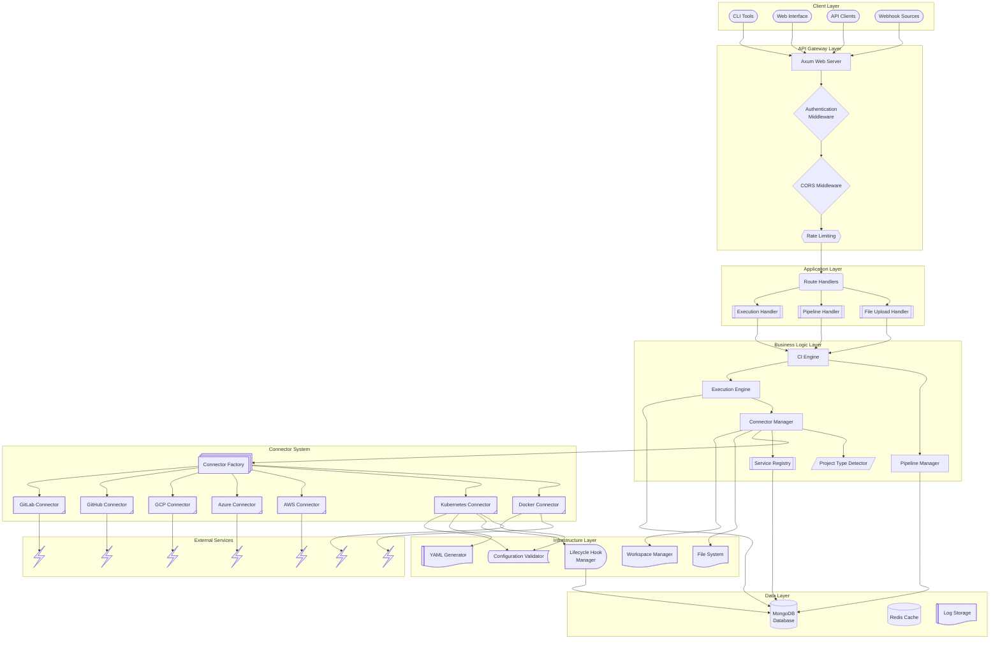
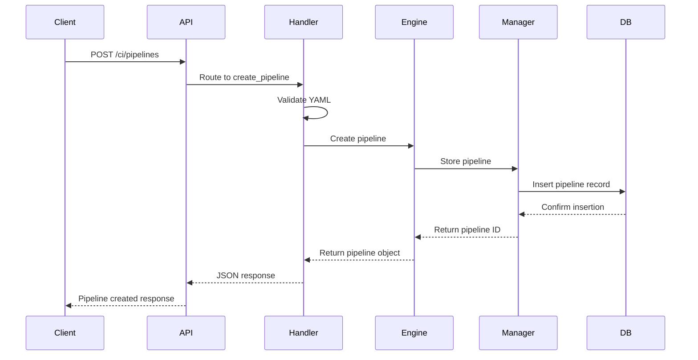
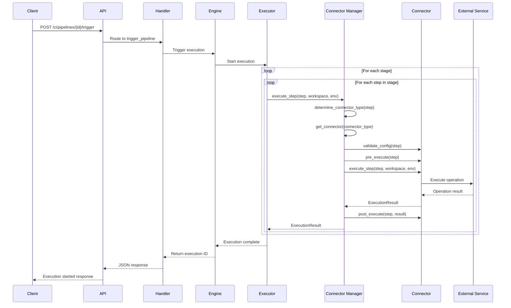

# System Architecture

This document provides a comprehensive overview of the RustCI system architecture, component interactions, and request flow patterns.

## System Overview

RustCI is a high-performance CI/CD platform built in Rust that provides pipeline execution, deployment management, and service orchestration capabilities. The system is designed for speed, reliability, and ease of use.

## Architecture Diagram



## Component Descriptions

### API Gateway Layer

#### Axum Web Server
- **Purpose**: HTTP server handling all incoming requests
- **Technology**: Axum framework with Tokio async runtime
- **Responsibilities**:
  - Request routing
  - HTTP/1.1 and HTTP/2 support
  - WebSocket connections (future)
  - Static file serving

#### Authentication Middleware
- **Purpose**: JWT-based authentication and authorization
- **Features**:
  - Token validation
  - User session management
  - OAuth integration (GitHub)
  - Role-based access control

#### CORS Middleware
- **Purpose**: Cross-origin resource sharing configuration
- **Configuration**:
  - Allowed origins
  - Allowed methods
  - Credential handling

### Application Layer

#### Route Handlers
- **Pipeline Routes**: `/api/ci/pipelines/*`
- **Execution Routes**: `/api/ci/executions/*`
- **Authentication Routes**: `/api/sessions/*`
- **Health Check**: `/api/healthchecker`

#### File Upload Handler
- **Purpose**: Handle multipart file uploads for YAML configurations
- **Features**:
  - File size validation (10MB limit)
  - MIME type checking
  - Temporary file management
  - YAML content validation

### Business Logic Layer

#### CI Engine
- **Purpose**: Core orchestration engine for CI/CD operations
- **Responsibilities**:
  - Pipeline lifecycle management
  - Execution coordination
  - Resource allocation
  - Error handling and recovery

```rust
pub struct CIEngine {
    pipeline_manager: Arc<PipelineManager>,
    execution_engine: Arc<ExecutionEngine>,
    deployment_manager: Arc<DeploymentManager>,
    database: Arc<Database>,
}
```

#### Pipeline Manager
- **Purpose**: Manage pipeline definitions and configurations
- **Operations**:
  - CRUD operations for pipelines
  - YAML parsing and validation
  - Pipeline versioning
  - Trigger management

#### Execution Engine
- **Purpose**: Execute pipeline stages and steps
- **Features**:
  - Parallel stage execution
  - Step dependency resolution
  - Real-time status updates
  - Log aggregation
  - Timeout handling

#### Connector Manager
- **Purpose**: Unified facade for managing all connector operations
- **Responsibilities**:
  - Factory registration and management
  - Connector caching and lifecycle
  - Step execution routing
  - Configuration validation
- **Design Patterns**:
  - Facade Pattern: Single interface for all connectors
  - Factory Pattern: Dynamic connector creation
  - Strategy Pattern: Pluggable execution strategies

## Connector System Architecture

The connector system is the core execution engine that provides pluggable, extensible pipeline step execution across different platforms and services.

### Design Patterns

#### Strategy Pattern
Each connector implements the `Connector` trait, allowing different execution strategies:

```rust
#[async_trait]
pub trait Connector: Send + Sync {
    async fn execute_step(&self, step: &Step, workspace: &Workspace, env: &HashMap<String, String>) -> Result<ExecutionResult>;
    fn connector_type(&self) -> ConnectorType;
    fn name(&self) -> &str;
    fn validate_config(&self, step: &Step) -> Result<()>;
    async fn pre_execute(&self, step: &Step) -> Result<()>;
    async fn post_execute(&self, step: &Step, result: &ExecutionResult) -> Result<()>;
}
```

#### Factory Pattern
The `ConnectorFactory` creates connector instances dynamically:

```rust
#[async_trait]
pub trait ConnectorFactory: Send + Sync {
    fn create_connector(&self, connector_type: ConnectorType) -> Result<Arc<dyn Connector>>;
    fn supports_type(&self, connector_type: &ConnectorType) -> bool;
    fn name(&self) -> &str;
}
```

#### Facade Pattern
The `ConnectorManager` provides a unified interface for all connector operations:

```rust
pub struct ConnectorManager {
    factories: HashMap<String, Arc<dyn ConnectorFactory>>,
    connector_cache: HashMap<ConnectorType, Arc<dyn Connector>>,
}
```

## Request Flow Patterns

### Pipeline Creation Flow



### Pipeline Execution Flow



## Data Models

### Core Entities

#### Pipeline
```rust
pub struct CIPipeline {
    pub id: Option<Uuid>,
    pub name: String,
    pub description: Option<String>,
    pub triggers: Vec<Trigger>,
    pub stages: Vec<Stage>,
    pub environment: HashMap<String, String>,
    pub timeout: u64,
    pub retry_count: u32,
    pub created_at: Option<DateTime<Utc>>,
    pub updated_at: Option<DateTime<Utc>>,
}
```

#### Execution
```rust
pub struct PipelineExecution {
    pub id: Uuid,
    pub pipeline_id: Uuid,
    pub status: ExecutionStatus,
    pub trigger_info: TriggerInfo,
    pub started_at: Option<DateTime<Utc>>,
    pub finished_at: Option<DateTime<Utc>>,
    pub duration: Option<u64>,
    pub stages: Vec<StageExecution>,
    pub logs: Vec<String>,
}
```

## Security Architecture

### Authentication Flow
1. Client requests OAuth authorization
2. GitHub OAuth callback provides authorization code
3. Server exchanges code for access token
4. Server generates JWT token
5. Client uses JWT for subsequent requests

### Security Measures
- JWT token expiration and refresh
- Input validation and sanitization
- File upload size and type restrictions
- Docker container isolation
- Environment variable encryption
- Rate limiting and DDoS protection

## Performance Considerations

### Async Architecture
- Tokio async runtime for non-blocking I/O
- Connection pooling for database operations
- Concurrent pipeline execution
- Streaming responses for large data

### Caching Strategy
- Pipeline configuration caching
- Execution status caching
- Docker image layer caching
- Git repository caching

### Resource Management
- Workspace cleanup after execution
- Container lifecycle management
- Port allocation and deallocation
- Memory usage monitoring

## Scalability Design

### Horizontal Scaling
- Stateless application design
- Database connection pooling
- Load balancer compatibility
- Session storage externalization

### Vertical Scaling
- Efficient memory usage
- CPU-intensive task optimization
- I/O operation optimization
- Resource monitoring and alerting

## Error Handling Strategy

### Error Categories
1. **Validation Errors**: Invalid input data
2. **Authentication Errors**: Authorization failures
3. **External Service Errors**: GitHub, Docker, SSH failures
4. **Internal Errors**: Database, file system issues
5. **Timeout Errors**: Long-running operation failures

### Error Response Format
```json
{
  "error": "ErrorType",
  "message": "Human-readable message",
  "details": "Additional context",
  "suggestions": ["Actionable suggestions"],
  "timestamp": "ISO 8601 timestamp"
}
```

## Monitoring and Observability

### Logging
- Structured logging with tracing crate
- Log levels: ERROR, WARN, INFO, DEBUG, TRACE
- Request/response logging
- Performance metrics logging

### Metrics
- Request latency and throughput
- Pipeline execution times
- Resource utilization
- Error rates and types

### Health Checks
- Application health endpoint
- Database connectivity check
- External service availability
- Resource usage monitoring