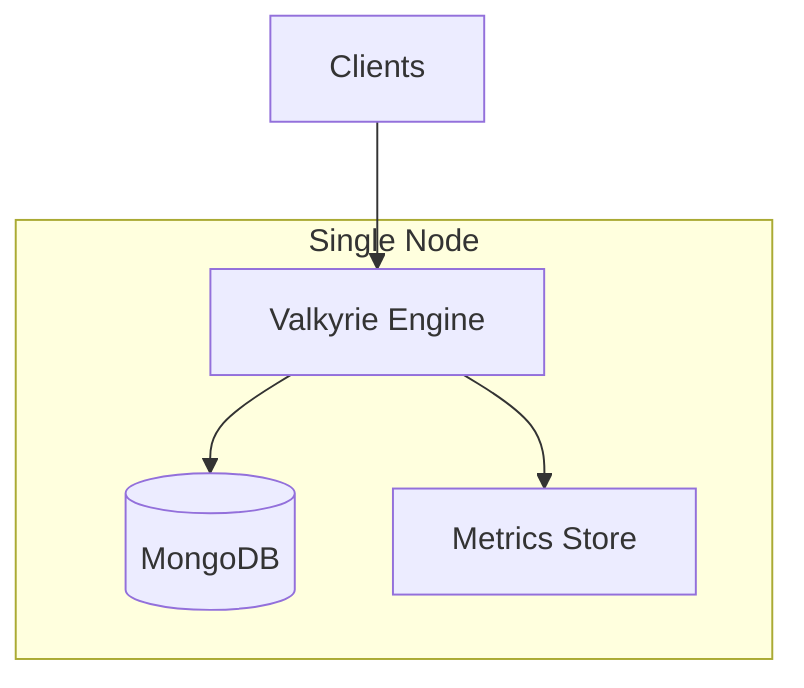
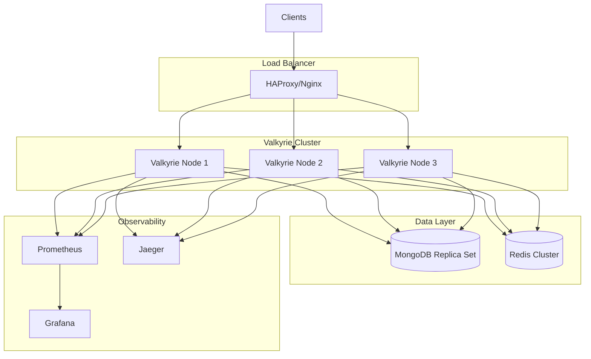
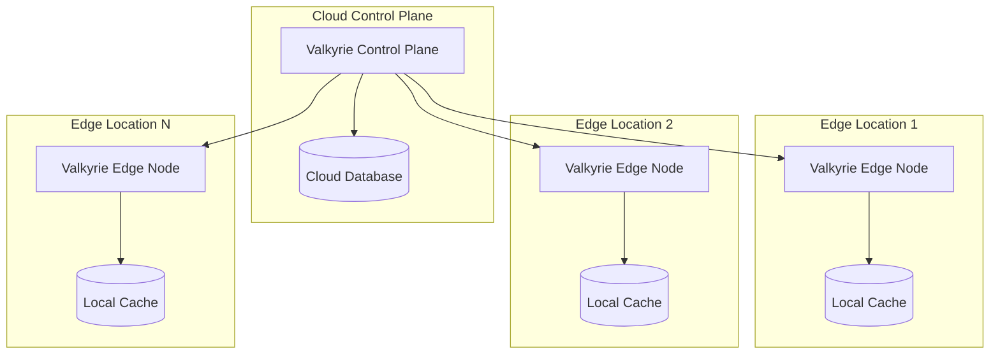

# Valkyrie Protocol Deployment Guide

This guide covers production deployment of the Valkyrie Protocol across different environments and platforms.

## Table of Contents

- [Prerequisites](#prerequisites)
- [Deployment Architectures](#deployment-architectures)
- [Container Deployment](#container-deployment)
- [Kubernetes Deployment](#kubernetes-deployment)
- [Cloud Provider Deployment](#cloud-provider-deployment)
- [High Availability Setup](#high-availability-setup)
- [Security Hardening](#security-hardening)
- [Monitoring and Observability](#monitoring-and-observability)
- [Performance Tuning](#performance-tuning)
- [Backup and Recovery](#backup-and-recovery)
- [Troubleshooting](#troubleshooting)

## Prerequisites

### System Requirements

#### Minimum Requirements
- **CPU**: 2 cores, 2.4 GHz
- **Memory**: 4 GB RAM
- **Storage**: 20 GB SSD
- **Network**: 1 Gbps
- **OS**: Linux (Ubuntu 20.04+, RHEL 8+, CentOS 8+)

#### Recommended Requirements
- **CPU**: 8 cores, 3.0 GHz
- **Memory**: 16 GB RAM
- **Storage**: 100 GB NVMe SSD
- **Network**: 10 Gbps
- **OS**: Linux with kernel 5.4+

#### High-Performance Requirements
- **CPU**: 32 cores, 3.5 GHz
- **Memory**: 64 GB RAM
- **Storage**: 500 GB NVMe SSD
- **Network**: 25+ Gbps
- **OS**: Linux with kernel 5.15+

### Software Dependencies

```bash
# Ubuntu/Debian
sudo apt update
sudo apt install -y \
    curl \
    wget \
    git \
    build-essential \
    pkg-config \
    libssl-dev \
    ca-certificates

# RHEL/CentOS
sudo yum update -y
sudo yum install -y \
    curl \
    wget \
    git \
    gcc \
    gcc-c++ \
    make \
    openssl-devel \
    ca-certificates
```

### Rust Installation

```bash
# Install Rust
curl --proto '=https' --tlsv1.2 -sSf https://sh.rustup.rs | sh
source ~/.cargo/env

# Verify installation
rustc --version
cargo --version
```

## Deployment Architectures

### Single Node Deployment

Suitable for development, testing, and small-scale production.



### Multi-Node Cluster

Recommended for production environments requiring high availability.



### Edge Deployment

For distributed edge computing scenarios.



## Container Deployment

### Docker Deployment

#### Single Container

```dockerfile
# Dockerfile.valkyrie
FROM rust:1.70-slim as builder

WORKDIR /app
COPY . .
RUN cargo build --release --features valkyrie

FROM debian:bookworm-slim

RUN apt-get update && apt-get install -y \
    ca-certificates \
    libssl3 \
    && rm -rf /var/lib/apt/lists/*

COPY --from=builder /app/target/release/valkyrie /usr/local/bin/valkyrie
COPY --from=builder /app/config/valkyrie.example.yaml /etc/valkyrie/config.yaml

EXPOSE 8080 8081 8443

USER 1000:1000

CMD ["valkyrie", "--config", "/etc/valkyrie/config.yaml"]
```

Build and run:

```bash
# Build image
docker build -f Dockerfile.valkyrie -t valkyrie:latest .

# Run container
docker run -d \
  --name valkyrie \
  -p 8080:8080 \
  -p 8081:8081 \
  -p 8443:8443 \
  -e VALKYRIE_TOKEN_SECRET="your-secret-key" \
  -v $(pwd)/config:/etc/valkyrie \
  valkyrie:latest
```

#### Docker Compose

```yaml
# docker-compose.production.yml
version: '3.8'

services:
  valkyrie:
    image: valkyrie:latest
    ports:
      - "8080:8080"
      - "8081:8081"
      - "8443:8443"
    environment:
      - VALKYRIE_TOKEN_SECRET=${VALKYRIE_TOKEN_SECRET}
      - VALKYRIE_LOG_LEVEL=info
      - VALKYRIE_MONGODB_URI=mongodb://mongodb:27017/valkyrie
      - VALKYRIE_REDIS_URI=redis://redis:6379
    volumes:
      - ./config/valkyrie.yaml:/etc/valkyrie/config.yaml:ro
      - ./certs:/etc/valkyrie/certs:ro
      - valkyrie_data:/var/lib/valkyrie
    depends_on:
      - mongodb
      - redis
    restart: unless-stopped
    healthcheck:
      test: ["CMD", "curl", "-f", "http://localhost:8081/health"]
      interval: 30s
      timeout: 10s
      retries: 3
      start_period: 40s

  mongodb:
    image: mongo:7
    environment:
      - MONGO_INITDB_ROOT_USERNAME=admin
      - MONGO_INITDB_ROOT_PASSWORD=${MONGODB_PASSWORD}
      - MONGO_INITDB_DATABASE=valkyrie
    volumes:
      - mongodb_data:/data/db
      - ./scripts/mongo-init.js:/docker-entrypoint-initdb.d/init.js:ro
    restart: unless-stopped
    command: mongod --replSet rs0 --bind_ip_all

  redis:
    image: redis:7-alpine
    command: redis-server --appendonly yes --requirepass ${REDIS_PASSWORD}
    volumes:
      - redis_data:/data
    restart: unless-stopped

  prometheus:
    image: prom/prometheus:latest
    ports:
      - "9090:9090"
    volumes:
      - ./config/prometheus.yml:/etc/prometheus/prometheus.yml:ro
      - prometheus_data:/prometheus
    command:
      - '--config.file=/etc/prometheus/prometheus.yml'
      - '--storage.tsdb.path=/prometheus'
      - '--web.console.libraries=/etc/prometheus/console_libraries'
      - '--web.console.templates=/etc/prometheus/consoles'
      - '--storage.tsdb.retention.time=200h'
      - '--web.enable-lifecycle'
    restart: unless-stopped

  grafana:
    image: grafana/grafana:latest
    ports:
      - "3000:3000"
    environment:
      - GF_SECURITY_ADMIN_PASSWORD=${GRAFANA_PASSWORD}
    volumes:
      - grafana_data:/var/lib/grafana
      - ./config/grafana:/etc/grafana/provisioning
    restart: unless-stopped

  jaeger:
    image: jaegertracing/all-in-one:latest
    ports:
      - "16686:16686"
      - "14268:14268"
    environment:
      - COLLECTOR_OTLP_ENABLED=true
    restart: unless-stopped

volumes:
  valkyrie_data:
  mongodb_data:
  redis_data:
  prometheus_data:
  grafana_data:

networks:
  default:
    driver: bridge
```

Environment file (`.env`):

```bash
# Security
VALKYRIE_TOKEN_SECRET=your-very-secure-secret-key-here
MONGODB_PASSWORD=secure-mongodb-password
REDIS_PASSWORD=secure-redis-password
GRAFANA_PASSWORD=secure-grafana-password

# Performance
VALKYRIE_MAX_CONNECTIONS=50000
VALKYRIE_WORKER_THREADS=8

# Observability
VALKYRIE_LOG_LEVEL=info
VALKYRIE_METRICS_ENABLED=true
VALKYRIE_TRACING_ENABLED=true
```

Deploy:

```bash
# Start services
docker-compose -f docker-compose.production.yml up -d

# Check status
docker-compose -f docker-compose.production.yml ps

# View logs
docker-compose -f docker-compose.production.yml logs -f valkyrie
```

## Kubernetes Deployment

### Namespace and RBAC

```yaml
# namespace.yaml
apiVersion: v1
kind: Namespace
metadata:
  name: valkyrie-system
  labels:
    name: valkyrie-system

---
# rbac.yaml
apiVersion: v1
kind: ServiceAccount
metadata:
  name: valkyrie
  namespace: valkyrie-system

---
apiVersion: rbac.authorization.k8s.io/v1
kind: ClusterRole
metadata:
  name: valkyrie
rules:
- apiGroups: [""]
  resources: ["nodes", "pods", "services", "endpoints"]
  verbs: ["get", "list", "watch"]
- apiGroups: ["apps"]
  resources: ["deployments", "replicasets"]
  verbs: ["get", "list", "watch"]

---
apiVersion: rbac.authorization.k8s.io/v1
kind: ClusterRoleBinding
metadata:
  name: valkyrie
roleRef:
  apiGroup: rbac.authorization.k8s.io
  kind: ClusterRole
  name: valkyrie
subjects:
- kind: ServiceAccount
  name: valkyrie
  namespace: valkyrie-system
```

### ConfigMap and Secrets

```yaml
# configmap.yaml
apiVersion: v1
kind: ConfigMap
metadata:
  name: valkyrie-config
  namespace: valkyrie-system
data:
  config.yaml: |
    protocol:
      version: "2.0"
      bind_address: "0.0.0.0:8080"
    
    transport:
      primary: "tcp"
      fallbacks: ["websocket"]
    
    security:
      mode: "token"
    
    performance:
      max_connections: 50000
      worker_threads: 8
    
    observability:
      metrics_enabled: true
      tracing_enabled: true
      log_level: "info"
    
    bridge:
      enabled: true
      http_port: 8081
      https_port: 8443

---
# secrets.yaml
apiVersion: v1
kind: Secret
metadata:
  name: valkyrie-secrets
  namespace: valkyrie-system
type: Opaque
data:
  token-secret: <base64-encoded-secret>
  mongodb-uri: <base64-encoded-mongodb-uri>
  redis-uri: <base64-encoded-redis-uri>
```

### Deployment

```yaml
# deployment.yaml
apiVersion: apps/v1
kind: Deployment
metadata:
  name: valkyrie
  namespace: valkyrie-system
  labels:
    app: valkyrie
spec:
  replicas: 3
  strategy:
    type: RollingUpdate
    rollingUpdate:
      maxUnavailable: 1
      maxSurge: 1
  selector:
    matchLabels:
      app: valkyrie
  template:
    metadata:
      labels:
        app: valkyrie
      annotations:
        prometheus.io/scrape: "true"
        prometheus.io/port: "8081"
        prometheus.io/path: "/metrics"
    spec:
      serviceAccountName: valkyrie
      securityContext:
        runAsNonRoot: true
        runAsUser: 1000
        runAsGroup: 1000
        fsGroup: 1000
      containers:
      - name: valkyrie
        image: valkyrie:latest
        imagePullPolicy: IfNotPresent
        ports:
        - name: valkyrie
          containerPort: 8080
          protocol: TCP
        - name: http
          containerPort: 8081
          protocol: TCP
        - name: https
          containerPort: 8443
          protocol: TCP
        env:
        - name: VALKYRIE_TOKEN_SECRET
          valueFrom:
            secretKeyRef:
              name: valkyrie-secrets
              key: token-secret
        - name: VALKYRIE_MONGODB_URI
          valueFrom:
            secretKeyRef:
              name: valkyrie-secrets
              key: mongodb-uri
        - name: VALKYRIE_REDIS_URI
          valueFrom:
            secretKeyRef:
              name: valkyrie-secrets
              key: redis-uri
        - name: VALKYRIE_NODE_NAME
          valueFrom:
            fieldRef:
              fieldPath: spec.nodeName
        - name: VALKYRIE_POD_NAME
          valueFrom:
            fieldRef:
              fieldPath: metadata.name
        - name: VALKYRIE_POD_NAMESPACE
          valueFrom:
            fieldRef:
              fieldPath: metadata.namespace
        volumeMounts:
        - name: config
          mountPath: /etc/valkyrie
          readOnly: true
        - name: certs
          mountPath: /etc/valkyrie/certs
          readOnly: true
        resources:
          requests:
            memory: "512Mi"
            cpu: "500m"
          limits:
            memory: "2Gi"
            cpu: "2000m"
        livenessProbe:
          httpGet:
            path: /health
            port: 8081
          initialDelaySeconds: 30
          periodSeconds: 10
          timeoutSeconds: 5
          failureThreshold: 3
        readinessProbe:
          httpGet:
            path: /ready
            port: 8081
          initialDelaySeconds: 5
          periodSeconds: 5
          timeoutSeconds: 3
          failureThreshold: 3
        securityContext:
          allowPrivilegeEscalation: false
          readOnlyRootFilesystem: true
          capabilities:
            drop:
            - ALL
      volumes:
      - name: config
        configMap:
          name: valkyrie-config
      - name: certs
        secret:
          secretName: valkyrie-tls
      nodeSelector:
        kubernetes.io/os: linux
      tolerations:
      - key: "node-role.kubernetes.io/control-plane"
        operator: "Exists"
        effect: "NoSchedule"
      affinity:
        podAntiAffinity:
          preferredDuringSchedulingIgnoredDuringExecution:
          - weight: 100
            podAffinityTerm:
              labelSelector:
                matchExpressions:
                - key: app
                  operator: In
                  values:
                  - valkyrie
              topologyKey: kubernetes.io/hostname
```

### Services

```yaml
# service.yaml
apiVersion: v1
kind: Service
metadata:
  name: valkyrie
  namespace: valkyrie-system
  labels:
    app: valkyrie
  annotations:
    service.beta.kubernetes.io/aws-load-balancer-type: "nlb"
    service.beta.kubernetes.io/aws-load-balancer-backend-protocol: "tcp"
spec:
  type: LoadBalancer
  ports:
  - name: valkyrie
    port: 8080
    targetPort: 8080
    protocol: TCP
  - name: http
    port: 8081
    targetPort: 8081
    protocol: TCP
  - name: https
    port: 8443
    targetPort: 8443
    protocol: TCP
  selector:
    app: valkyrie

---
# headless service for internal communication
apiVersion: v1
kind: Service
metadata:
  name: valkyrie-headless
  namespace: valkyrie-system
  labels:
    app: valkyrie
spec:
  clusterIP: None
  ports:
  - name: valkyrie
    port: 8080
    targetPort: 8080
    protocol: TCP
  selector:
    app: valkyrie
```

### Ingress

```yaml
# ingress.yaml
apiVersion: networking.k8s.io/v1
kind: Ingress
metadata:
  name: valkyrie-ingress
  namespace: valkyrie-system
  annotations:
    kubernetes.io/ingress.class: "nginx"
    nginx.ingress.kubernetes.io/ssl-redirect: "true"
    nginx.ingress.kubernetes.io/backend-protocol: "HTTP"
    nginx.ingress.kubernetes.io/proxy-body-size: "100m"
    nginx.ingress.kubernetes.io/proxy-read-timeout: "300"
    nginx.ingress.kubernetes.io/proxy-send-timeout: "300"
    cert-manager.io/cluster-issuer: "letsencrypt-prod"
spec:
  tls:
  - hosts:
    - valkyrie.example.com
    secretName: valkyrie-tls
  rules:
  - host: valkyrie.example.com
    http:
      paths:
      - path: /
        pathType: Prefix
        backend:
          service:
            name: valkyrie
            port:
              number: 8081
```

### Horizontal Pod Autoscaler

```yaml
# hpa.yaml
apiVersion: autoscaling/v2
kind: HorizontalPodAutoscaler
metadata:
  name: valkyrie-hpa
  namespace: valkyrie-system
spec:
  scaleTargetRef:
    apiVersion: apps/v1
    kind: Deployment
    name: valkyrie
  minReplicas: 3
  maxReplicas: 20
  metrics:
  - type: Resource
    resource:
      name: cpu
      target:
        type: Utilization
        averageUtilization: 70
  - type: Resource
    resource:
      name: memory
      target:
        type: Utilization
        averageUtilization: 80
  - type: Pods
    pods:
      metric:
        name: valkyrie_connections_active
      target:
        type: AverageValue
        averageValue: "1000"
  behavior:
    scaleDown:
      stabilizationWindowSeconds: 300
      policies:
      - type: Percent
        value: 10
        periodSeconds: 60
    scaleUp:
      stabilizationWindowSeconds: 60
      policies:
      - type: Percent
        value: 50
        periodSeconds: 60
      - type: Pods
        value: 2
        periodSeconds: 60
      selectPolicy: Max
```

Deploy to Kubernetes:

```bash
# Apply all manifests
kubectl apply -f namespace.yaml
kubectl apply -f rbac.yaml
kubectl apply -f configmap.yaml
kubectl apply -f secrets.yaml
kubectl apply -f deployment.yaml
kubectl apply -f service.yaml
kubectl apply -f ingress.yaml
kubectl apply -f hpa.yaml

# Check deployment status
kubectl get pods -n valkyrie-system
kubectl get services -n valkyrie-system
kubectl get ingress -n valkyrie-system

# View logs
kubectl logs -f deployment/valkyrie -n valkyrie-system
```

## Cloud Provider Deployment

### AWS EKS

```bash
# Create EKS cluster
eksctl create cluster \
  --name valkyrie-cluster \
  --version 1.28 \
  --region us-west-2 \
  --nodegroup-name valkyrie-nodes \
  --node-type m5.xlarge \
  --nodes 3 \
  --nodes-min 3 \
  --nodes-max 10 \
  --managed

# Install AWS Load Balancer Controller
kubectl apply -k "github.com/aws/eks-charts/stable/aws-load-balancer-controller//crds?ref=master"

helm repo add eks https://aws.github.io/eks-charts
helm install aws-load-balancer-controller eks/aws-load-balancer-controller \
  -n kube-system \
  --set clusterName=valkyrie-cluster \
  --set serviceAccount.create=false \
  --set serviceAccount.name=aws-load-balancer-controller
```

### Google GKE

```bash
# Create GKE cluster
gcloud container clusters create valkyrie-cluster \
  --zone us-central1-a \
  --num-nodes 3 \
  --enable-autoscaling \
  --min-nodes 3 \
  --max-nodes 10 \
  --machine-type n1-standard-4 \
  --enable-autorepair \
  --enable-autoupgrade

# Get credentials
gcloud container clusters get-credentials valkyrie-cluster --zone us-central1-a
```

### Azure AKS

```bash
# Create resource group
az group create --name valkyrie-rg --location eastus

# Create AKS cluster
az aks create \
  --resource-group valkyrie-rg \
  --name valkyrie-cluster \
  --node-count 3 \
  --enable-addons monitoring \
  --generate-ssh-keys \
  --node-vm-size Standard_D4s_v3

# Get credentials
az aks get-credentials --resource-group valkyrie-rg --name valkyrie-cluster
```

## High Availability Setup

### Multi-Region Deployment

```yaml
# Global load balancer configuration
apiVersion: v1
kind: ConfigMap
metadata:
  name: global-lb-config
data:
  haproxy.cfg: |
    global
        daemon
        maxconn 4096
    
    defaults
        mode tcp
        timeout connect 5000ms
        timeout client 50000ms
        timeout server 50000ms
    
    frontend valkyrie_frontend
        bind *:8080
        default_backend valkyrie_backend
    
    backend valkyrie_backend
        balance roundrobin
        server us-west valkyrie-us-west.example.com:8080 check
        server us-east valkyrie-us-east.example.com:8080 check
        server eu-west valkyrie-eu-west.example.com:8080 check
```

### Database Replication

```yaml
# MongoDB replica set configuration
apiVersion: v1
kind: ConfigMap
metadata:
  name: mongodb-config
data:
  mongod.conf: |
    storage:
      dbPath: /data/db
    net:
      port: 27017
      bindIp: 0.0.0.0
    replication:
      replSetName: "valkyrie-rs"
    security:
      authorization: enabled
      keyFile: /etc/mongodb/keyfile
```

### Disaster Recovery

```bash
#!/bin/bash
# backup-script.sh

# Backup MongoDB
mongodump --host mongodb-primary:27017 \
  --username admin \
  --password $MONGODB_PASSWORD \
  --authenticationDatabase admin \
  --out /backup/mongodb/$(date +%Y%m%d_%H%M%S)

# Backup configuration
kubectl get configmaps -n valkyrie-system -o yaml > /backup/k8s/configmaps.yaml
kubectl get secrets -n valkyrie-system -o yaml > /backup/k8s/secrets.yaml

# Upload to cloud storage
aws s3 sync /backup/ s3://valkyrie-backups/$(date +%Y%m%d)/
```

## Security Hardening

### Network Security

```yaml
# Network policies
apiVersion: networking.k8s.io/v1
kind: NetworkPolicy
metadata:
  name: valkyrie-network-policy
  namespace: valkyrie-system
spec:
  podSelector:
    matchLabels:
      app: valkyrie
  policyTypes:
  - Ingress
  - Egress
  ingress:
  - from:
    - namespaceSelector:
        matchLabels:
          name: ingress-nginx
    ports:
    - protocol: TCP
      port: 8081
  - from:
    - podSelector:
        matchLabels:
          app: valkyrie
    ports:
    - protocol: TCP
      port: 8080
  egress:
  - to:
    - namespaceSelector:
        matchLabels:
          name: mongodb
    ports:
    - protocol: TCP
      port: 27017
  - to: []
    ports:
    - protocol: TCP
      port: 443
    - protocol: TCP
      port: 53
    - protocol: UDP
      port: 53
```

### Pod Security Standards

```yaml
# Pod security policy
apiVersion: policy/v1beta1
kind: PodSecurityPolicy
metadata:
  name: valkyrie-psp
spec:
  privileged: false
  allowPrivilegeEscalation: false
  requiredDropCapabilities:
    - ALL
  volumes:
    - 'configMap'
    - 'emptyDir'
    - 'projected'
    - 'secret'
    - 'downwardAPI'
    - 'persistentVolumeClaim'
  runAsUser:
    rule: 'MustRunAsNonRoot'
  seLinux:
    rule: 'RunAsAny'
  fsGroup:
    rule: 'RunAsAny'
```

### TLS Configuration

```bash
# Generate TLS certificates
openssl req -x509 -nodes -days 365 -newkey rsa:2048 \
  -keyout valkyrie.key \
  -out valkyrie.crt \
  -subj "/CN=valkyrie.example.com/O=valkyrie"

# Create TLS secret
kubectl create secret tls valkyrie-tls \
  --cert=valkyrie.crt \
  --key=valkyrie.key \
  -n valkyrie-system
```

## Monitoring and Observability

### Prometheus Configuration

```yaml
# prometheus-config.yaml
apiVersion: v1
kind: ConfigMap
metadata:
  name: prometheus-config
data:
  prometheus.yml: |
    global:
      scrape_interval: 15s
      evaluation_interval: 15s
    
    rule_files:
      - "valkyrie_rules.yml"
    
    scrape_configs:
    - job_name: 'valkyrie'
      kubernetes_sd_configs:
      - role: pod
        namespaces:
          names:
          - valkyrie-system
      relabel_configs:
      - source_labels: [__meta_kubernetes_pod_annotation_prometheus_io_scrape]
        action: keep
        regex: true
      - source_labels: [__meta_kubernetes_pod_annotation_prometheus_io_path]
        action: replace
        target_label: __metrics_path__
        regex: (.+)
      - source_labels: [__address__, __meta_kubernetes_pod_annotation_prometheus_io_port]
        action: replace
        regex: ([^:]+)(?::\d+)?;(\d+)
        replacement: $1:$2
        target_label: __address__
    
    alerting:
      alertmanagers:
      - static_configs:
        - targets:
          - alertmanager:9093
  
  valkyrie_rules.yml: |
    groups:
    - name: valkyrie
      rules:
      - alert: ValkyrieHighConnectionCount
        expr: valkyrie_connections_active > 45000
        for: 5m
        labels:
          severity: warning
        annotations:
          summary: "High connection count on Valkyrie node"
          description: "Valkyrie node {{ $labels.instance }} has {{ $value }} active connections"
      
      - alert: ValkyrieHighLatency
        expr: histogram_quantile(0.95, valkyrie_message_latency_seconds) > 0.001
        for: 2m
        labels:
          severity: critical
        annotations:
          summary: "High message latency on Valkyrie node"
          description: "95th percentile latency is {{ $value }}s on {{ $labels.instance }}"
      
      - alert: ValkyrieNodeDown
        expr: up{job="valkyrie"} == 0
        for: 1m
        labels:
          severity: critical
        annotations:
          summary: "Valkyrie node is down"
          description: "Valkyrie node {{ $labels.instance }} has been down for more than 1 minute"
```

### Grafana Dashboards

```json
{
  "dashboard": {
    "title": "Valkyrie Protocol Dashboard",
    "panels": [
      {
        "title": "Active Connections",
        "type": "stat",
        "targets": [
          {
            "expr": "sum(valkyrie_connections_active)",
            "legendFormat": "Total Connections"
          }
        ]
      },
      {
        "title": "Message Throughput",
        "type": "graph",
        "targets": [
          {
            "expr": "rate(valkyrie_messages_sent_total[5m])",
            "legendFormat": "Messages Sent/sec"
          },
          {
            "expr": "rate(valkyrie_messages_received_total[5m])",
            "legendFormat": "Messages Received/sec"
          }
        ]
      },
      {
        "title": "Message Latency",
        "type": "graph",
        "targets": [
          {
            "expr": "histogram_quantile(0.50, valkyrie_message_latency_seconds)",
            "legendFormat": "50th percentile"
          },
          {
            "expr": "histogram_quantile(0.95, valkyrie_message_latency_seconds)",
            "legendFormat": "95th percentile"
          },
          {
            "expr": "histogram_quantile(0.99, valkyrie_message_latency_seconds)",
            "legendFormat": "99th percentile"
          }
        ]
      }
    ]
  }
}
```

## Performance Tuning

### System-Level Optimizations

```bash
# /etc/sysctl.conf
net.core.somaxconn = 65535
net.core.netdev_max_backlog = 5000
net.ipv4.tcp_max_syn_backlog = 65535
net.ipv4.tcp_fin_timeout = 30
net.ipv4.tcp_keepalive_time = 1200
net.ipv4.tcp_rmem = 4096 65536 16777216
net.ipv4.tcp_wmem = 4096 65536 16777216
net.core.rmem_max = 16777216
net.core.wmem_max = 16777216
fs.file-max = 1000000

# Apply settings
sysctl -p
```

### Container Resource Limits

```yaml
resources:
  requests:
    memory: "2Gi"
    cpu: "1000m"
  limits:
    memory: "8Gi"
    cpu: "4000m"
```

### JVM Tuning (for Java clients)

```bash
export JAVA_OPTS="-Xms2g -Xmx8g -XX:+UseG1GC -XX:MaxGCPauseMillis=200"
```

## Backup and Recovery

### Automated Backup

```yaml
# backup-cronjob.yaml
apiVersion: batch/v1
kind: CronJob
metadata:
  name: valkyrie-backup
  namespace: valkyrie-system
spec:
  schedule: "0 2 * * *"
  jobTemplate:
    spec:
      template:
        spec:
          containers:
          - name: backup
            image: mongo:7
            command:
            - /bin/bash
            - -c
            - |
              mongodump --host $MONGODB_HOST \
                --username $MONGODB_USER \
                --password $MONGODB_PASSWORD \
                --authenticationDatabase admin \
                --out /backup/$(date +%Y%m%d_%H%M%S)
              
              # Upload to S3
              aws s3 sync /backup/ s3://valkyrie-backups/
            env:
            - name: MONGODB_HOST
              value: "mongodb:27017"
            - name: MONGODB_USER
              valueFrom:
                secretKeyRef:
                  name: mongodb-secret
                  key: username
            - name: MONGODB_PASSWORD
              valueFrom:
                secretKeyRef:
                  name: mongodb-secret
                  key: password
            volumeMounts:
            - name: backup-storage
              mountPath: /backup
          volumes:
          - name: backup-storage
            emptyDir: {}
          restartPolicy: OnFailure
```

### Disaster Recovery Procedure

```bash
#!/bin/bash
# disaster-recovery.sh

echo "Starting disaster recovery procedure..."

# 1. Restore from backup
mongorestore --host mongodb-primary:27017 \
  --username admin \
  --password $MONGODB_PASSWORD \
  --authenticationDatabase admin \
  --drop \
  /backup/latest/

# 2. Restart Valkyrie nodes
kubectl rollout restart deployment/valkyrie -n valkyrie-system

# 3. Verify health
kubectl wait --for=condition=ready pod -l app=valkyrie -n valkyrie-system --timeout=300s

# 4. Run health checks
curl -f http://valkyrie.example.com/health

echo "Disaster recovery completed successfully"
```

## Troubleshooting

### Common Issues

#### High Memory Usage

```bash
# Check memory usage
kubectl top pods -n valkyrie-system

# Analyze memory leaks
kubectl exec -it deployment/valkyrie -n valkyrie-system -- \
  curl http://localhost:8081/debug/pprof/heap
```

#### Connection Issues

```bash
# Check network connectivity
kubectl exec -it deployment/valkyrie -n valkyrie-system -- \
  netstat -tulpn

# Test port connectivity
kubectl exec -it deployment/valkyrie -n valkyrie-system -- \
  telnet mongodb 27017
```

#### Performance Issues

```bash
# Check CPU usage
kubectl top pods -n valkyrie-system

# Analyze performance
kubectl exec -it deployment/valkyrie -n valkyrie-system -- \
  curl http://localhost:8081/debug/pprof/profile
```

### Log Analysis

```bash
# View structured logs
kubectl logs -f deployment/valkyrie -n valkyrie-system | jq '.'

# Filter error logs
kubectl logs deployment/valkyrie -n valkyrie-system | grep ERROR

# Export logs for analysis
kubectl logs deployment/valkyrie -n valkyrie-system --since=1h > valkyrie.log
```

### Health Checks

```bash
# Basic health check
curl -f http://valkyrie.example.com/health

# Detailed status
curl http://valkyrie.example.com/api/v1/status

# Metrics endpoint
curl http://valkyrie.example.com/metrics
```

This deployment guide provides comprehensive coverage for deploying the Valkyrie Protocol in production environments. For specific deployment scenarios or troubleshooting, refer to the [troubleshooting section](troubleshooting.md) or consult the community resources.