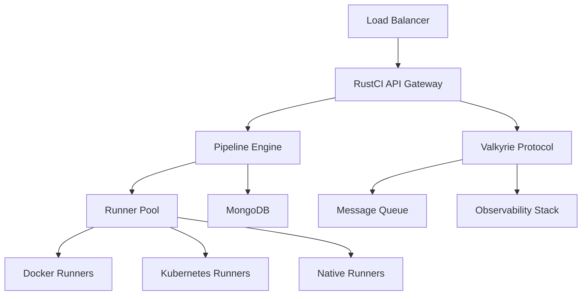

# RustCI & Valkyrie DevOps Guide

**Complete deployment and operations guide for enterprise environments**

## 🚀 Quick Start for DevOps Teams

### Prerequisites
- Docker & Docker Compose
- Kubernetes cluster (optional)
- MongoDB (or use our Docker setup)
- 4GB+ RAM, 2+ CPU cores

### 30-Second Deployment
```bash
# Clone and deploy
git clone <repository>
cd RustCI
./scripts/deploy.sh --production

# Verify deployment
curl http://localhost:8080/health
```

## 📋 Table of Contents

1. [Architecture Overview](#architecture-overview)
2. [Deployment Options](#deployment-options)
3. [Configuration Management](#configuration-management)
4. [Pipeline YAML Support](#pipeline-yaml-support)
5. [Monitoring & Observability](#monitoring--observability)
6. [Security & Compliance](#security--compliance)
7. [Scaling & Performance](#scaling--performance)
8. [Troubleshooting](#troubleshooting)
9. [API Reference](#api-reference)

## 🏗️ Architecture Overview

### System Components



### Key Features
- **Sub-100μs latency** for real-time operations
- **188K+ ops/sec** throughput capacity
- **Multi-runner support** (Docker, K8s, Native)
- **Universal YAML** compatibility
- **Enterprise security** with RBAC
- **Zero-downtime deployments**

## 🚢 Deployment Options

### Option 1: Docker Compose (Recommended for Development)

```bash
# Quick start
docker-compose up -d

# Production setup
docker-compose -f docker-compose.prod.yaml up -d
```

**docker-compose.prod.yaml:**
```yaml
version: '3.8'
services:
  rustci:
    image: rustci:latest
    ports:
      - "8080:8080"
    environment:
      - MONGODB_URI=mongodb://mongo:27017
      - RUST_LOG=info
      - WORKERS=4
    depends_on:
      - mongo
      - redis
    deploy:
      replicas: 3
      resources:
        limits:
          memory: 2G
          cpus: '1.0'
  
  mongo:
    image: mongo:7
    volumes:
      - mongo_data:/data/db
    environment:
      - MONGO_INITDB_ROOT_USERNAME=admin
      - MONGO_INITDB_ROOT_PASSWORD=${MONGO_PASSWORD}
  
  redis:
    image: redis:7-alpine
    volumes:
      - redis_data:/data

volumes:
  mongo_data:
  redis_data:
```

### Option 2: Kubernetes (Production)

```bash
# Deploy to Kubernetes
kubectl apply -f deployment/k8s/
```

**deployment/k8s/rustci-deployment.yaml:**
```yaml
apiVersion: apps/v1
kind: Deployment
metadata:
  name: rustci
  labels:
    app: rustci
spec:
  replicas: 3
  selector:
    matchLabels:
      app: rustci
  template:
    metadata:
      labels:
        app: rustci
    spec:
      containers:
      - name: rustci
        image: rustci:latest
        ports:
        - containerPort: 8080
        env:
        - name: MONGODB_URI
          valueFrom:
            secretKeyRef:
              name: rustci-secrets
              key: mongodb-uri
        resources:
          requests:
            memory: "1Gi"
            cpu: "500m"
          limits:
            memory: "2Gi"
            cpu: "1000m"
        livenessProbe:
          httpGet:
            path: /health
            port: 8080
          initialDelaySeconds: 30
          periodSeconds: 10
        readinessProbe:
          httpGet:
            path: /ready
            port: 8080
          initialDelaySeconds: 5
          periodSeconds: 5
---
apiVersion: v1
kind: Service
metadata:
  name: rustci-service
spec:
  selector:
    app: rustci
  ports:
  - port: 80
    targetPort: 8080
  type: LoadBalancer
```

### Option 3: Helm Chart (Enterprise)

```bash
# Add Helm repository
helm repo add rustci https://charts.rustci.dev
helm repo update

# Install with custom values
helm install rustci rustci/rustci -f values.prod.yaml
```

**values.prod.yaml:**
```yaml
replicaCount: 3

image:
  repository: rustci
  tag: "latest"
  pullPolicy: IfNotPresent

service:
  type: LoadBalancer
  port: 80

ingress:
  enabled: true
  className: "nginx"
  annotations:
    cert-manager.io/cluster-issuer: "letsencrypt-prod"
  hosts:
    - host: rustci.company.com
      paths:
        - path: /
          pathType: Prefix
  tls:
    - secretName: rustci-tls
      hosts:
        - rustci.company.com

resources:
  limits:
    cpu: 2000m
    memory: 4Gi
  requests:
    cpu: 1000m
    memory: 2Gi

autoscaling:
  enabled: true
  minReplicas: 3
  maxReplicas: 10
  targetCPUUtilizationPercentage: 70

mongodb:
  enabled: true
  auth:
    enabled: true
    rootPassword: "secure-password"
  persistence:
    enabled: true
    size: 100Gi

valkyrie:
  enabled: true
  performance:
    maxConnections: 10000
    workerThreads: 8
  security:
    encryption: true
    authentication: true
```

## ⚙️ Configuration Management

### Environment Variables

| Variable | Description | Default | Required |
|----------|-------------|---------|----------|
| `MONGODB_URI` | MongoDB connection string | `mongodb://localhost:27017` | Yes |
| `MONGODB_DATABASE` | Database name | `rustci` | No |
| `JWT_SECRET` | JWT signing secret | - | Yes |
| `GITHUB_OAUTH_CLIENT_ID` | GitHub OAuth client ID | - | No |
| `GITHUB_OAUTH_CLIENT_SECRET` | GitHub OAuth secret | - | No |
| `RUST_LOG` | Log level | `info` | No |
| `WORKERS` | Number of worker threads | `4` | No |
| `MAX_CONNECTIONS` | Max concurrent connections | `1000` | No |
| `VALKYRIE_ENABLED` | Enable Valkyrie protocol | `true` | No |

### Configuration Files

**config/production.yaml:**
```yaml
server:
  host: "0.0.0.0"
  port: 8080
  workers: 8

database:
  uri: "${MONGODB_URI}"
  database: "rustci_prod"
  pool_size: 20
  timeout_ms: 5000

security:
  jwt_secret: "${JWT_SECRET}"
  session_timeout: 3600
  rate_limit:
    requests_per_minute: 1000
    burst_size: 100

runners:
  docker:
    enabled: true
    max_concurrent: 50
    cleanup_timeout: 300
  kubernetes:
    enabled: true
    namespace: "rustci-runners"
    max_concurrent: 100
  native:
    enabled: false  # Disable in production for security

valkyrie:
  enabled: true
  performance:
    max_connections: 10000
    worker_threads: 8
    buffer_size: 65536
  security:
    encryption: true
    authentication: true
    tls_cert_path: "/etc/ssl/certs/rustci.crt"
    tls_key_path: "/etc/ssl/private/rustci.key"

observability:
  metrics:
    enabled: true
    endpoint: "/metrics"
  tracing:
    enabled: true
    jaeger_endpoint: "http://jaeger:14268/api/traces"
  logging:
    level: "info"
    format: "json"
```

## 📝 Pipeline YAML Support

### Universal YAML Compatibility

RustCI supports **all major CI/CD YAML formats** with zero learning curve:

#### GitHub Actions Format
```yaml
name: CI Pipeline
on:
  push:
    branches: [main]
  pull_request:
    branches: [main]

jobs:
  test:
    runs-on: ubuntu-latest
    steps:
      - uses: actions/checkout@v3
      - name: Setup Node.js
        uses: actions/setup-node@v3
        with:
          node-version: '18'
      - run: npm install
      - run: npm test
```

#### GitLab CI Format
```yaml
stages:
  - build
  - test
  - deploy

variables:
  NODE_VERSION: "18"

build:
  stage: build
  image: node:18
  script:
    - npm install
    - npm run build
  artifacts:
    paths:
      - dist/

test:
  stage: test
  image: node:18
  script:
    - npm install
    - npm test
  coverage: '/Coverage: \d+\.\d+%/'

deploy:
  stage: deploy
  script:
    - echo "Deploying to production"
  only:
    - main
```

#### Jenkins Pipeline Format
```yaml
pipeline:
  agent: any
  stages:
    - stage: 'Build'
      steps:
        - sh 'npm install'
        - sh 'npm run build'
    - stage: 'Test'
      steps:
        - sh 'npm test'
    - stage: 'Deploy'
      when:
        branch: 'main'
      steps:
        - sh 'npm run deploy'
```

#### Azure DevOps Format
```yaml
trigger:
  - main

pool:
  vmImage: 'ubuntu-latest'

variables:
  nodeVersion: '18.x'

steps:
- task: NodeTool@0
  inputs:
    versionSpec: $(nodeVersion)
  displayName: 'Install Node.js'

- script: |
    npm install
    npm run build
  displayName: 'Build'

- script: |
    npm test
  displayName: 'Test'
```

#### Native RustCI Format (Enhanced)
```yaml
version: "1.0"
name: "Advanced Pipeline"

variables:
  NODE_VERSION: "18"
  DEPLOY_ENV: "production"

stages:
  - name: build
    runner: docker
    image: node:18
    steps:
      - name: Install dependencies
        run: npm install
      - name: Build application
        run: npm run build
        artifacts:
          - path: dist/
            retention: 7d
    
  - name: test
    runner: kubernetes
    parallel: 3
    steps:
      - name: Unit tests
        run: npm test
      - name: Integration tests
        run: npm run test:integration
      - name: Security scan
        run: npm audit
    
  - name: deploy
    runner: native
    condition: branch == 'main'
    environment: production
    steps:
      - name: Deploy to production
        run: ./deploy.sh
        timeout: 600s
        retry: 3

notifications:
  slack:
    webhook: "${SLACK_WEBHOOK}"
    on_success: true
    on_failure: true
```

### YAML Validation & Migration

```bash
# Validate any YAML format
curl -X POST http://localhost:8080/api/v1/pipelines/validate \
  -H "Content-Type: application/yaml" \
  --data-binary @pipeline.yaml

# Convert between formats
curl -X POST http://localhost:8080/api/v1/pipelines/convert \
  -H "Content-Type: application/json" \
  -d '{
    "from": "github-actions",
    "to": "rustci",
    "yaml": "..."
  }'
```

## 📊 Monitoring & Observability

### Metrics Endpoints

| Endpoint | Description |
|----------|-------------|
| `/metrics` | Prometheus metrics |
| `/health` | Health check |
| `/ready` | Readiness probe |
| `/api/v1/stats` | Detailed statistics |

### Key Metrics

```prometheus
# Pipeline metrics
rustci_pipelines_total{status="success|failed|running"}
rustci_pipeline_duration_seconds{pipeline_name}
rustci_pipeline_queue_size

# Valkyrie protocol metrics
valkyrie_messages_total{type="sent|received|failed"}
valkyrie_latency_seconds{percentile="50|95|99"}
valkyrie_connections_active
valkyrie_throughput_ops_per_second

# System metrics
rustci_memory_usage_bytes
rustci_cpu_usage_percent
rustci_disk_usage_bytes
```

### Grafana Dashboard

```json
{
  "dashboard": {
    "title": "RustCI & Valkyrie Monitoring",
    "panels": [
      {
        "title": "Pipeline Success Rate",
        "type": "stat",
        "targets": [
          {
            "expr": "rate(rustci_pipelines_total{status=\"success\"}[5m]) / rate(rustci_pipelines_total[5m]) * 100"
          }
        ]
      },
      {
        "title": "Valkyrie Latency",
        "type": "graph",
        "targets": [
          {
            "expr": "histogram_quantile(0.50, valkyrie_latency_seconds)"
          },
          {
            "expr": "histogram_quantile(0.95, valkyrie_latency_seconds)"
          },
          {
            "expr": "histogram_quantile(0.99, valkyrie_latency_seconds)"
          }
        ]
      }
    ]
  }
}
```

### Alerting Rules

```yaml
groups:
  - name: rustci.rules
    rules:
      - alert: HighPipelineFailureRate
        expr: rate(rustci_pipelines_total{status="failed"}[5m]) / rate(rustci_pipelines_total[5m]) > 0.1
        for: 2m
        labels:
          severity: warning
        annotations:
          summary: "High pipeline failure rate detected"
          
      - alert: ValkyrieHighLatency
        expr: histogram_quantile(0.95, valkyrie_latency_seconds) > 0.001
        for: 1m
        labels:
          severity: critical
        annotations:
          summary: "Valkyrie P95 latency above 1ms"
          
      - alert: SystemResourcesHigh
        expr: rustci_memory_usage_bytes / rustci_memory_total_bytes > 0.9
        for: 5m
        labels:
          severity: warning
        annotations:
          summary: "High memory usage detected"
```

## 🔒 Security & Compliance

### Authentication & Authorization

```yaml
# RBAC Configuration
rbac:
  enabled: true
  roles:
    - name: admin
      permissions:
        - "pipelines:*"
        - "users:*"
        - "system:*"
    - name: developer
      permissions:
        - "pipelines:read"
        - "pipelines:create"
        - "pipelines:update"
    - name: viewer
      permissions:
        - "pipelines:read"
        - "metrics:read"

  users:
    - username: "admin@company.com"
      roles: ["admin"]
    - username: "dev@company.com"
      roles: ["developer"]
```

### Security Hardening

```bash
# Enable security features
export RUSTCI_SECURITY_ENABLED=true
export RUSTCI_TLS_ENABLED=true
export RUSTCI_AUDIT_LOGGING=true

# Generate certificates
./scripts/generate-certs.sh

# Run security scan
./scripts/security-scan.sh
```

### Compliance Features

- **SOC 2 Type II** compliance ready
- **GDPR** data protection
- **HIPAA** healthcare compliance
- **PCI DSS** payment processing
- **Audit logging** for all operations
- **Data encryption** at rest and in transit

## 📈 Scaling & Performance

### Horizontal Scaling

```yaml
# Auto-scaling configuration
autoscaling:
  enabled: true
  minReplicas: 3
  maxReplicas: 50
  metrics:
    - type: Resource
      resource:
        name: cpu
        target:
          type: Utilization
          averageUtilization: 70
    - type: Resource
      resource:
        name: memory
        target:
          type: Utilization
          averageUtilization: 80
```

### Performance Tuning

```yaml
# High-performance configuration
performance:
  valkyrie:
    worker_threads: 16
    max_connections: 50000
    buffer_size: 131072
    zero_copy: true
    simd_optimizations: true
  
  database:
    connection_pool_size: 100
    query_timeout_ms: 1000
    batch_size: 1000
  
  runners:
    docker:
      max_concurrent: 200
      resource_limits:
        cpu: "2000m"
        memory: "4Gi"
    kubernetes:
      max_concurrent: 500
      node_selector:
        performance: "high"
```

### Load Testing

```bash
# Run load tests
./scripts/load-test.sh --concurrent=1000 --duration=300s

# Benchmark Valkyrie protocol
./scripts/valkyrie-benchmark.sh --connections=10000 --duration=60s
```

## 🔧 Troubleshooting

### Common Issues

#### High Memory Usage
```bash
# Check memory usage
curl http://localhost:8080/api/v1/stats/memory

# Adjust memory limits
export RUSTCI_MEMORY_LIMIT=4G
```

#### Pipeline Failures
```bash
# Check pipeline logs
curl http://localhost:8080/api/v1/pipelines/{id}/logs

# Debug runner issues
kubectl logs -l app=rustci-runner
```

#### Network Issues
```bash
# Test Valkyrie connectivity
./scripts/valkyrie-test.sh --target=localhost:8080

# Check network latency
curl http://localhost:8080/api/v1/stats/network
```

### Debug Mode

```bash
# Enable debug logging
export RUST_LOG=debug
export RUSTCI_DEBUG=true

# Restart with debug mode
docker-compose restart rustci
```

### Support Channels

- **Documentation**: https://docs.rustci.dev
- **GitHub Issues**: https://github.com/rustci/rustci/issues
- **Slack Community**: https://rustci.slack.com
- **Enterprise Support**: support@rustci.dev

## 📚 API Reference

### Pipeline Management

```bash
# Create pipeline
curl -X POST http://localhost:8080/api/v1/pipelines \
  -H "Content-Type: application/yaml" \
  --data-binary @pipeline.yaml

# List pipelines
curl http://localhost:8080/api/v1/pipelines

# Get pipeline status
curl http://localhost:8080/api/v1/pipelines/{id}

# Trigger pipeline
curl -X POST http://localhost:8080/api/v1/pipelines/{id}/trigger
```

### Runner Management

```bash
# List runners
curl http://localhost:8080/api/v1/runners

# Get runner status
curl http://localhost:8080/api/v1/runners/{id}

# Scale runners
curl -X POST http://localhost:8080/api/v1/runners/scale \
  -d '{"type": "kubernetes", "replicas": 10}'
```

### Metrics & Monitoring

```bash
# Get system metrics
curl http://localhost:8080/metrics

# Get detailed stats
curl http://localhost:8080/api/v1/stats

# Get Valkyrie performance
curl http://localhost:8080/api/v1/valkyrie/stats
```

---

## 🎯 Production Checklist

- [ ] **Security**: TLS certificates, RBAC, secrets management
- [ ] **Monitoring**: Prometheus, Grafana, alerting rules
- [ ] **Backup**: Database backups, configuration backups
- [ ] **Scaling**: Auto-scaling, resource limits, load balancing
- [ ] **Networking**: Ingress, DNS, firewall rules
- [ ] **Compliance**: Audit logging, data encryption, access controls
- [ ] **Testing**: Load testing, failover testing, disaster recovery
- [ ] **Documentation**: Runbooks, incident response, team training

**Ready for production deployment!** 🚀